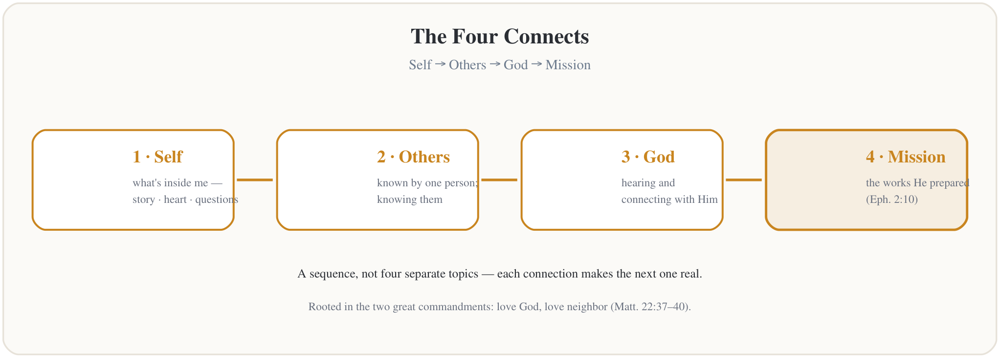

> **DRAFT v1, for John's edits.** Written to be handed to the elders or pastor of a church, or the leadership of a ministry, who are being asked to cover a prototype Fellowship of the Heart group as a trial run. Short on purpose. Every section ends where the deeper material begins, and the last page lists it. Written for the Living Hope elders, Grace Covenant Church, and The Crucible Project; names are not in the body.

{width=65%}

# How to use this page

One sitting, sixty to seventy-five minutes, run the way a Fellowship of the Heart session runs: a question to the room before any teaching, a short teaching, discussion that gets the most time, and then the questions I would want answered if I were the one being asked to vouch for this. Nothing here needs to be agreed to on the day. A yes, a not-yet, and a no are all answers I will thank you for.

**Open with.** *When one of your people says "I want to hear God and do what He says," what does your church actually give them to do next week?*

# The essence

Fellowship of the Heart is a small group of believers walking four connections together, in order, in a safe room, under your covering, until they can hear God and obey Him together and then go and do the same for others.

The four connections are the Four Connects: **Self**, **Others**, **God**, **Mission**. They come from the two great commandments (Matthew 22:37–40), and their order is not a syllabus but a sequence. You cannot connect honestly with others until you have begun to know yourself. You cannot connect with God beyond performance until you are honest with yourself and at least one person knows your interior life. You cannot find the works God prepared for you (Ephesians 2:10) until the first three are real.

{width=80%}

Every session is built the same way. A container is opened, the same words every week. A short teaching from one anchor passage. A practice, walked together in a small circle: telling a piece of your story, reading Scripture with a simple six-step method called PROAPT that ends with telling someone what you heard, diagnosing the soil of your own heart from Mark 4, bringing an honest doubt to God, naming a gift and where it might serve. Then the container is closed, the same words every week, and everyone is sent home with one practice to keep. The unit of a session is a practice, not a talk. The year is built the way trust is built: Week 1 asks for nothing braver than your name and one true sentence, and every week asks slightly more than the last, at a pace a person can keep.

{width=65%}

# What it is not

- **Not therapy.** The work may be therapeutic; it is not therapy, and it holds that rail deliberately. Leaders serve in a pastoral role, not a clinical one. Anything that needs professional care is handed to a named person outside the group.
- **Not content to sit through.** No one is being taught a curriculum. They are walking practices and taking them home.
- **Not demanded.** No one is ever required to share anything. Anyone may pass, sit out, or step out at any time, with no explanation and no penalty. Practices are offered, leadership is offered, and the door stays open.
- **Not a credential.** No one licenses a Formation Companion and no one ever will from here. Standing comes from a named covering close enough to see a life, and only lasts as long as they can see it.
- **Not a new church, and not a parachurch.** The group is yours. It runs on your people, in your building or one of their homes, under your authority. The written pattern travels; trust does not travel with it, and it is not meant to.

# Where it comes from

Twenty-plus years of small-group heart work, most of it men's work, distilled into a written record called the Intentional Journey of the Heart. Fellowship of the Heart is that record's operating form: the curriculum, the handbooks, the lesson plans, the cards. Everything is published under an open license, free to read and free to run. A pilot edition for teens and their parents was prepared this year for a Christian school and has not yet launched, which is part of why I am here: the first cohort needs a home, and it may be yours.

Two editions exist. A **twenty-two-week family edition**, teens with a parent in the room, built for a school year. And an **adult edition**, leadership-first, in which a church's own leaders walk the year before any family is asked to trust it. The adult edition is the one I would normally propose to a church.

# What you would be overseeing

This is the heart of the page. The handbook puts it in one line: *nobody covers themselves, the founder included.* A covering does six things.

1. **Appoints or confirms the Lead Companion.** The curriculum is signed off under your authority, the Lead Companion reports to you on a standing cadence, and you can pause or end the work.
2. **Confirms every Companion has a covering of their own.** A named person, close enough to see their life, under whose direction they already sit. This is a selection requirement, not a preference. A Companion without one is not eligible until one exists. You do not supervise that relationship; you confirm it is there.
3. **Signs the safety floor before Week 1.** One page. It is blocking: the group does not begin until every line is true. The lines are below.
4. **Names the door out.** One adult outside the Companion team whom every participant is told they can reach, for the thing a person will not say in the room. It may be you. It cannot be a Companion or the parent of a participant.
5. **Hears how it is going.** Once a month for the length of one series, in whatever form you want: a conversation, the Companion team's weekly readings, or nothing but the assurance that you can ask.
6. **Can stop it.** Quietly, locally, and restoratively where possible. The same nearness that grants standing can withdraw it.

{width=60%}

## The safety floor, as written

- Two adults present in every room, without exception. No adult is ever alone with a participant.
- Written consent before Week 1: parent or guardian consent and student assent where minors are involved, adult consent otherwise, with a plain-words cover sheet that says what will happen and what no one will be made to do.
- A confidentiality covenant signed by every participant, with its limits stated plainly: what is shared in the circle stays in the circle, except where safety or the law requires otherwise.
- A written crisis-response protocol and a quick-reference card every team member carries.
- A pastoral or clinical backup named and on call for every session, and a referral list with verified local numbers. If a week's backup is not confirmed, that week's deep work runs in its light form or waits.
- Background checks for every adult on the team to the standard you apply to anyone who works with your people.
- A signed Measurement Covenant governing anything the team observes or records, renewed annually. Its one governing sentence: *measure nothing you will not weep over.*

# What a prototype would look like

Three shapes, and you choose. Each is one series, so you are committing to a season, not a program.

- **A leadership circle first.** Six to ten of your leaders walk the adult Getting Started series: fifteen sessions with two two-week practice holds built in, so that when no meeting is holding them, what continues at their kitchen tables is what the year has actually formed. This is the shape I recommend, because a leadership team that finishes it knows from the inside what it would be asking of anyone else.
- **An evening group.** Eight to twelve adults, weekly or every other week, seventy-five to ninety minutes, in a home or a room at the church, walking Getting Started.
- **A family evening group.** Teens with a parent each, the twenty-two-week edition, with willing older teens leading the scripted, low-risk segments under two adults and three published safety rules that never bend. This is the edition that was built and never got its cohort.

For any of the three: a team of two or three Companions, one of them the Lead; a named backup; the door out; the safety floor signed; a room, coffee, and printed cards. The curriculum costs nothing.

{width=60%}

# What we watch, and what we refuse to measure

The team reads three vital signs in an ordinary session, with no form in anyone's hand. **Costly telling**: does anyone tell the group what God said and what they did about it, and does it ever cost them something to say? **Response to load**: what does the room do in the first ten seconds after an interruption, hard news, or real grief? **The sought stray**: when someone goes quiet or goes missing, how long before anyone notices, and who goes after them? Everything deeper in the assessment plan is used rarely and only when a vital sign says to look closer.

What we refuse. No one is ever told their level, ranked, or sorted. No journal is collected or read. No photographs or recordings of anyone's sharing. Participant content belongs to the participants, and no license covers it. Knowledge of hearts, in institutional hands, drifts toward sorting and then managing; the written limits are what hold, and you can hold them too.

# Our posture toward your tradition

We are a guest. The Apostles' and Nicene Creeds are the doctrinal floor. Scripture is the floor under every session; the framework behind it is offered as one way of seeing what Scripture shows, never as the authority. Where the work overlaps cleanly with ordinary evangelical formation, which is most of it, we lean there: story, Scripture engagement, confession, community, prayer. The experiential practices are introduced gently, with consent, as invitations. We hold back deep wound work, deliverance ministry, and anything high-intensity from a beginning group, and we do not litigate contested questions about the gifts in either direction. On disputed theological questions, we defer to your policy and present more than one faithful voice.

{width=60%}

# Discussion

1. Which of your people already do this, whether or not they have a name for it? Who would you trust in a circle of six with someone's story?
2. What would you need to see in a first season to say "again," and what would make you say "stop"?
3. Of the three shapes, which one fits the life your church is already living?

# The covering's questions, answered straight

- *Who trained you?* The pattern's whole answer is one sentence a Companion should be able to say: *"I was formed in this pattern at [name of household], under [name of covering], and you're welcome to go talk with them."* For me: a Band of Brothers over many years, under my own church and pastor. You are welcome to talk with them.
- *What happens when someone is harmed, or discloses something?* The Companion stops and hands it to the named backup or the door out; the crisis protocol names who is told, in what order; mandatory-reporting law governs. And you can stop the group.
- *Does this compete with our small groups or discipleship?* It is a pattern your own people run for your own people. If your groups already do this, you do not need it. If they gather but do not form, this is what forming looks like on a Tuesday night.
- *What does it cost us?* A named person's attention once a month, a room, a signature on one page, and the willingness to be told if it is not working.
- *What if we say no?* Thank you, and I mean it. A no from people who read this is worth more than a yes from people who did not.

{width=45%}

# The ask

Would you cover one prototype group for one series: appoint or confirm its Lead Companion, confirm each Companion's own covering, sign its safety floor, name its door out, hear how it goes once a month, and hold the right to stop it at any time?

Take your time. The asking is large and the saying-yes should be slow.

*Grace and peace,*

*John*

---

# Deeper, when you want it

- **The site.** The full curriculum, all three series, every lesson plan and card: [fellowshipoftheheart.org](https://jgtittle-ministries.github.io/fellowship-of-the-heart-pilot-at-cca/). Free to read and free to run.
- **Companions and Coverings.** Two pages on what this work is and is not, and why no one is ever certified. Read this one first.
- **The Getting Started handbook, Sections 3 and 6.** The Companion team and the covering; safety, confidentiality, and crisis protocols, including the launch-blocking checklist.
- **The Three Vital Signs** and **the Measurement Covenant.** What the team watches, and the limits it signs.
- **The Plain-Words Cover Sheet.** What a participant is agreeing to, in one page.
- **A Church Prepared for Revival.** The companion book for a leadership team: two questions, do you want a revival, and what might it take to prepare the soil.
- **The Intentional Journey of the Heart.** The written record behind all of it. Start with *Read Me First* and the one-page map of the Country of the Heart. A longer briefing exists, eight sittings across all six volumes, for a covering that wants the whole.
