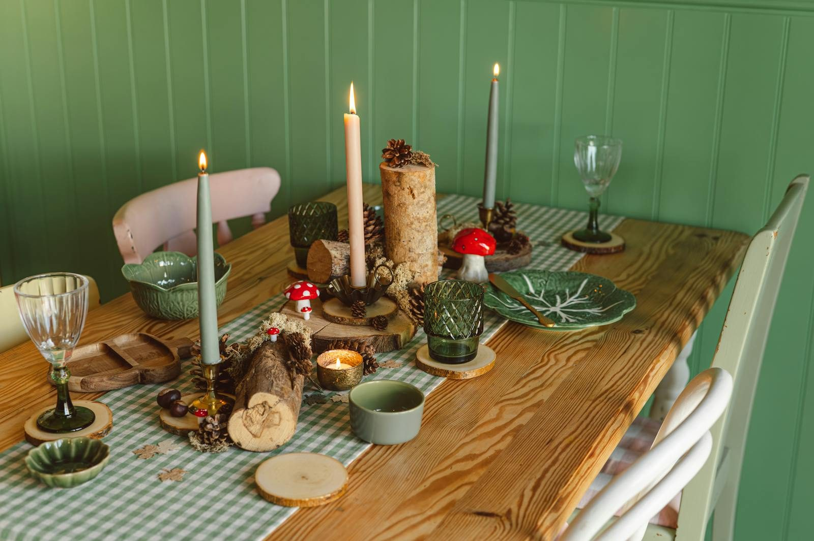

# Getting Started

*The Four Connects, walked over twenty-two Wednesday evenings.*

The first of the three Fellowship of the Heart series. Twenty-two weekly sessions — one continuous Wednesday-evening walk across a full club year of four quarters — that introduce the **Four Connects** (connecting with **Self**, with **Others**, with **God**, and with **Mission**) and settle them into a daily rhythm a cohort can sustain on its own. Every week has its own full session plan, numbered in one sequence from the first welcome to the final commissioning; the quarter breaks are built into the walk, with a re-entry evening opening each new quarter. See [The CCA 2026–27 Dates](cca-2026-27-calendar.md) for this year's calendar, and the [CHANGELOG](CHANGELOG.md) for the version ledger (v1.0 fifteen-week age-split edition · v1.1 calendar overlay · v1.3 family-integrated edition · v1.4 the seamless twenty-two-week year).

A cohort that completes Getting Started can stop here and not go further. That ending is honored. *Going Deeper* and *Going Out* are for those the Spirit prepares to keep walking.

These files are the **Companion Lesson Plans** — what the Lead Companion and Co-Companion team hold during the session. The participant-facing materials — the [Personal Heart Journal](../shared/personal-heart-journal.md), the [Rhythm Card](../shared/rhythm-card.md), the [Family Conversation Cards](../shared/family-conversation-cards.md), and the [PROAPT card](../shared/proapt-card.md) — live in [Shared Materials](../shared/index.md). The **[session slide deck (PowerPoint, v1.4)](gs-session-slides-v1.4.pptx)** is the room screen for all twenty-two sessions — one slide per road stop, the five standing liturgical images, big read-aloud type; the plan carries the evening, the screen only keeps it visible.

Companions who want the academic backbone of this series will find it in the IJH Hearing-God Paper [CTG — Clearing the Ground](https://jgtittle-ministries.github.io/Intentional-Journey-of-the-Heart-dev/reader.html#docs%2Fvolume-5-references%2Fclearing-the-ground-lower-levels.md), which develops formation through the lower levels — Receiving, Responding, Valuing — and takes this curriculum as its worked example.

---

## The twenty-two weeks

**Quarter 1 — Self and Others**

| # | Title | Connect focus | Anchor scripture |
|---|---|---|---|
| 1 | [Welcome to the Journey](week-01-welcome.md) | All four (introductory) | John 10:10b |
| 2 | [The Soil of Your Heart](week-02-soil.md) | Self | Mark 4:1–20 |
| 3 | [Telling Your Story I](week-03-story.md) | Self → Others | Psalm 139:23–24 |
| 4 | [Telling Your Story II](week-04-story-2.md) *(second running — teen-led)* | Self → Others | Psalm 139:23–24 |
| 5 | [Knowing and Being Known](week-05-known.md) | Others | Ecclesiastes 4:9–12 |
| 6 | [Safe and Brave Together](week-06-brave.md) *(Quarterly Pulse 1; the quarter closes)* | Others (deepening) | James 5:16; 1 John 1:9 |

**Quarter 2 — God**

| # | Title | Connect focus | Anchor scripture |
|---|---|---|---|
| 7 | [Hearing God in Scripture — PROAPT I](week-07-proapt.md) *(re-entry opening)* | God | Romans 10:17; Mark 1:14–20 |
| 8 | [Hearing God — PROAPT II](week-08-proapt-2.md) *(second running — teen-led)* | God | Romans 10:17 |
| 9 | [The Garden of Your Heart I](week-09-garden.md) | God | John 15:1–11; Psalm 23 |
| 10 | [The Garden of Your Heart II](week-10-garden-2.md) *(second running — teen-led walk-through)* | God | John 15:1–11 |
| 11 | [Any Doubts?](week-11-doubts.md) *(the year's midpoint; Quarterly Pulse 2)* | God | Mark 9:24 |

**Quarter 3 — Mission and Rhythm**

| # | Title | Connect focus | Anchor scripture |
|---|---|---|---|
| 12 | [The Return](week-12-return.md) *(full re-entry after Christmas)* | All four (re-entry) | Lamentations 3:22–23 |
| 13 | [What Was Prepared for You](week-13-mission.md) | Mission | Ephesians 2:10 |
| 14 | [Second Running: Block A](week-14-second-running-a.md) *(teen-led)* | God / Others (second running) | 1 Timothy 4:12 |
| 15 | [The Rhythm and the Four Questions](week-15-rhythm.md) *(teen-led marquee)* | All four (sustaining) | Galatians 6:9; Psalm 139:23–24 |
| 16 | [Family Conversation Night](week-16-family-night.md) *(cards and a shared meal; Quarterly Pulse 3)* | Others (family warmth) | Acts 2:46 |
| 17 | [The Float](week-17-float.md) *(absorbs the calendar's surprises; the quarter closes)* | All four (flex) | Proverbs 16:9 |

**Quarter 4 — Consolidation and Sending**

| # | Title | Connect focus | Anchor scripture |
|---|---|---|---|
| 18 | [The Return II](week-18-return-2.md) *(light re-entry; the final stretch mapped)* | All four (re-entry) | Galatians 6:9; Philippians 1:6 |
| 19 | [Second Running: Block B](week-19-second-running-b.md) *(the Companions-in-Formation rehearse the mercy cards)* | All four (rehearsal) | 2 Timothy 2:2 |
| 20 | [The Long Walk](week-20-long-walk.md) *(the mercy cards taught to the room; Post-Series Survey)* | All four (consolidation) | Isaiah 50:10 |
| 21 | [Sending and Blessing](week-21-sending.md) *(120 minutes — family commissioning)* | All four (integration) | Numbers 6:24–26; Philippians 1:6 |
| 22 | [Commissioning the Companions](week-22-commissioning.md) | All four | 2 Timothy 2:2; 1 Timothy 4:12 |

---

## The arc

The twenty-two weeks are not twenty-two independent lessons. They are one walk through the Four Connects across a year, with the quarter breaks built into the design:

- **Week 1** opens the container. The whole cohort meets the form for the first time.
- **Weeks 2–4** are **Connecting with Self** — the Heart Soil diagnostic from Mark 4, then the practice of telling your story to a small circle, completed across two runnings.
- **Weeks 5–6** are **Connecting with Others** — naming the four conditions of a real container (Safe, Present, Clear, Intentional), then practicing confession-and-restoration together. Week 6 closes the first quarter, and the first Quarterly Pulse goes home.
- **Weeks 7–11** are **Connecting with God** — Week 7 re-enters after the break, then PROAPT as a hearing practice in scripture (two runnings), the Garden of Your Heart as a relational encounter (two runnings), and the Any Doubts? practice for the gap between what we say and what we trust. Week 11 is the exact midpoint of the year and closes the quarter at the Christmas break.
- **Week 12, The Return,** rebuilds the room in January and reads — without shame — what the break did with the practices.
- **Week 13** opens **Connecting with Mission** — uphill mission and downhill mission, gifts and passions, *the works prepared beforehand*.
- **Week 15** installs the long walk and opens the family's deepest conversation — the Rhythm Card built personally, and the Four Questions presented: the parent asks their own teen, at home, if willing, *what has it been like to live with me?*
- **Weeks 16–17** let the quarter exhale — a family night of cards and a shared meal, then the Float, which absorbs whatever the calendar threw at the year (or walks the Rhythm Cards live if nothing did).
- **Weeks 18–20** hand the year over — a light re-entry, then the Companions-in-Formation rehearse and finally teach the two mercy cards (Signs, Path Home) to the whole room at The Long Walk, with the year's journals reviewed and testimonies gathered.
- **Weeks 21–22** close in two movements — the whole cohort sent through a family commissioning, then the Companions-in-Formation commissioned as FC1 in a witnessed rite of their own.

The second-running weeks (4, 8, 10, 14, 19) are where willing teens lead — see the Handbook's Section 11 (the Companion-in-Formation track) for the bright line between what a teen leads and what an adult always holds.

Weeks **3–4**, **6**, **9–10**, and **11** are the sessions where the Companion team holds the most weight. Each lesson plan flags its specific risks under **WATCH FOR** and, where applicable, **Crisis Contingencies**. Read those before walking into the room.

---

## What each lesson plan contains

Every file follows the same structure:

- **Quick Reference Card** — print on cardstock; two copies in the room.
- **WATCH FOR** — the specific risks of this session, named so the team can prepare.
- **Session at a Glance** — why this session, this week; dependencies on prior weeks; the Connect focus.
- **Pre-Work** for the Companion team and, in some weeks, for participants.
- **Materials and Setup** — checklist, room arrangement, pre-session preparation timeline.
- **Detailed Run Sheet** — minute-by-minute flow for the 75 minutes on the pilot's clock (120 for Week 21); an evening-meeting body will find the plans breathe easily back out to ninety.
- **Block-by-Block Scripts and Notes** — what the Lead Companion may want in front of them, knowing the live room will ask for something slightly different than the page.
- **Between-session practice** — the daily and weekly rhythm participants carry into the week.
- **IJH source** — where the material lives in *Intentional Journey of the Heart*, for the Companion who wants to read further.

The lesson plans are written for the Companion team. They are detailed on purpose. A new Companion preparing for Week 3 or Week 5 should not be guessing at what to do when the room goes quiet, when a teen weeps, when a parent tries to fix what they should be receiving. The page is a floor under your feet, not a script you read from.

By Week 10 you will not need the page. By the end of *Going Out* you may be writing your own.

---

## Cadence and logistics

- **Length.** Ninety minutes every week, except Week 21 — 120 minutes for the family commissioning night.
- **Companion team.** A Lead Companion plus Cluster Companions. Most working weeks share opening and teaching whole-room, then move into FAMILY CLUSTERS — two or three whole families with a Cluster Companion, own family always together, parents first on sharing rounds — and MERGE for the Leader Feedback Round and closing. Weeks 1, 21, and 22 stay whole-room the entire session (Week 16 gathers at tables for the family meal); any week stays whole-room when attendance is about ten or fewer.
- **Cohort size.** Three to six families in the v1.3 pilot — roughly six to fifteen participants; one breakout room when the room clusters.
- **Participants.** Parent-teen pairs, individuals, and households (see [`../index.md`](../index.md) for the wider fit).

---

## Status

**Curriculum v1.4, August 2026 — the seamless twenty-two-week year.** Pilot edition for the first Covenant Christian Academy cohort. A body wanting a shorter, consecutive run should start from the fifteen-week edition preserved at git tag `gs-v1.0`; this edition is the full club year, and the model is not CCA-specific. These materials will change as the cohort teaches us where they are right, where they bend, and where they break. See [`CHANGELOG.md`](CHANGELOG.md) for what shifts between versions.

---

*Further up and further in.*
