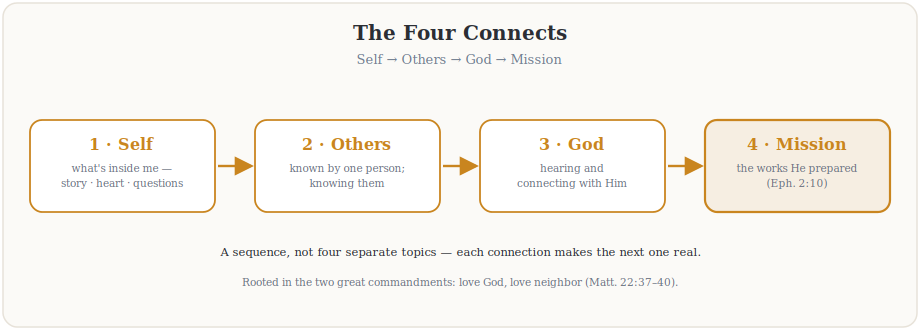

**FELLOWSHIP OF THE HEART**

*Getting Started series — The Four Connects*

Week 1

**Welcome to the Journey**

*Establishing the container; introducing the four Connects*

**COMPANION LESSON PLAN**

Pilot edition — Covenant Christian Academy of Warrenton

*Based on the Intentional Journey of the Heart (IJH), Volumes 1–6*

*John G. Tittle • Curriculum draft v1, May 2026*

# Quick Reference Card

*Print this page on cardstock. Two copies in the room — one for the Lead Companion, one for the Co-Companion team. Glance at it during the session.*

## WEEK 1 — WELCOME TO THE JOURNEY (90 minutes)

**Aim.** Establish the container with this specific cohort, introduce the four Connects as the spine of Getting Started, and give every participant their first taste of what genuine community feels like.

**Anchor scripture.** John 10:10b — “I came that they may have life and have it abundantly.”

**Connect focus.** All four (introductory level).

**Mode.** Shared circle the entire session. No parallel split in Week 1.

**Center.** First experience of the full container protocol with this cohort. Each participant says one true sentence about why they are here.

**Between-session practice.** Daily morning question (5 minutes); brief evening journal note.

**IJH source.** Vol 2 Intro and Eighth Exploration (the container).

## WATCH FOR (Week 1 specific risks)

- First-night nerves. Some teens will be there because Mom said. That is fine. Do not pressure them to engage beyond their willingness in Week 1.
- Parents trying to chaperone. The first time you see a parent moving toward managing their kid, gently redirect. “Tonight we are all participants. Let me hold the space.”
- Sentimentality. Avoid making Week 1 emotionally heavy. The work of Getting Started is real; tonight is the doorway. Don’t rush it.
- Over-explaining IJH. Resist the urge to teach the whole framework in Week 1. Ten minutes maximum.

## CRISIS CONTINGENCIES (Week 1)

Week 1 is unlikely to surface acute crisis material; the practice is gentle by design. But if anything heavy emerges, default to Section 6 of the Handbook — the protocols for suicidal ideation, abuse disclosure, and heavy-not-crisis disclosures all apply.

# Session at a Glance

### Title and one-sentence aim

**Title:** Welcome to the Journey.

**One-sentence aim:** By the end of tonight, every person in the room has experienced the full container protocol once, knows the shape of the four Connects journey we are starting, and has said one true sentence in front of the cohort about why they are here.

### Scripture anchor

*“I came that they may have life and have it abundantly.”*

— John 10:10b (ESV)

Use this single verse. Do not expand to surrounding context tonight; the cohort will return to John 15 and other Christological passages in later weeks. Let “abundantly” do its own work.

### Connect lineage and dependencies

Week 1 introduces all four Connects but works at none of them in depth. The session’s real work is in establishing the container that the rest of Getting Started depends on.

Vol 2 sources for tonight:

1. Vol 2 Intro — the framing of “the journey” and what makes IJH not a program but an exploration.
2. Vol 2 Fifth Exploration — the four Connects sequence: Self → Others → God → Mission.
3. Vol 2 Eighth Exploration — the four container conditions (Safe, Present, Clear, Intentional).

**Dependencies.** Week 1 depends only on the Family Orientation Night having happened. Week 1 is itself the dependency for Weeks 2–15 — the container experienced tonight is what the rest of the series will build on. If the container does not form tonight, slow down before you accelerate.

# Pre-Work for Participants

Pre-work for Week 1 is light by design. Heavy pre-work in the first session is a setup for failure — most participants will not have done it, and starting the series with everyone behind on assignments creates the wrong tone. The Family Orientation Night two weeks earlier was the real on-ramp.

### For every participant (10 minutes, the morning of the session)

1. Read John 10:10 once. Sit with the word “abundantly” for a minute. What does abundance mean to you right now? Are you living in any of it?
2. Look at your Personal Heart Journal. Read the front-matter “This journal is yours” page once.
3. Bring the journal tonight. Bring a pen.
4. Plan to arrive ten minutes early. The session begins on time.

### For parent-and-teen, separately (5 minutes, in the car on the way)

Parent and teen do not coordinate on this. Each, separately, finishes this sentence in their own head:

*“One reason I’m really here tonight is \_\_\_\_\_\_\_\_\_\_\_\_\_\_\_\_\_.”*

Do not share with each other. The first sharing happens in the circle.

# Materials and Setup

### Materials checklist

- Chairs in a single circle, one per participant. No table in the middle.
- Phone-box at the door (a labeled wooden or cardboard box). Sign on the box: “Phones rest here for the next 90 minutes.”
- Name tags + markers (first names only).
- Personal Heart Journal for each participant. (Distributed at orientation; remind participants to bring tonight.)
- Welcome packet (one page) — see Handout H1.1.
- Aaronic blessing card — one per family — see Handout H1.2.
- Flip chart or whiteboard at one edge of the circle. Pre-draw the four Connects diagram (template in Handout H1.1).
- Large-print Bible (ESV). Read aloud from the physical book, not from a phone.
- Light snacks and water at the door for arrival window. Nothing during session.
- A wall clock or visible timer somewhere only the Lead Companion can see.
- One box of tissues, somewhere in the room. Do not draw attention to it.

### Room arrangement

Single circle of chairs, no table, no podium. The Lead Companion sits in the circle, not at the head. The whiteboard is positioned so the Lead Companion can stand and use it without leaving the circle’s gravitational center for long.

If you have more than 24 participants, use two concentric semicircles rather than a stretched-out single circle. People should be able to see every face.

### Pre-session preparation timeline

| **When** | **Action** | **Who** |
| --- | --- | --- |
| Week before | Final RSVP confirmations; print welcome packets and blessing cards; verify all Personal Heart Journals are distributed. | Lead Comp |
| Day before | Walk the room. Confirm phone-box, name tags, snacks, journals, Bible, board markers, tissues. Phone the pastoral / clinical backup person to confirm availability. | Lead Companion + Co-Comp |
| T-30 min | All Companions in the room. Pre-draw the four Connects diagram on the board. Set out chairs. Set name tags and markers at the door. Pray together as a team. | All Companions |
| T-15 min | Door opens. One Co-Companion at the door welcoming, handing out name tags, pointing to the phone-box. | Co-Comp (Teen) |
| T-0 | Begin on time. | Lead Comp |

# Detailed 90-Minute Run Sheet

Times below assume a 7:00 PM start. Adjust to your actual start time but keep the durations.

| **Time** | **Block** | **Mode** | **Lead** | **Min** |
| --- | --- | --- | --- | --- |
| 6:30 | Setup. All Companions in the room. Final walk-through. | — | Team | 30 |
| 6:45 | Door opens. Greet, name tags, phone-box, light snacks. | Open | Teen Comp | 15 |
| 7:00 | Welcome and the very-first-time orientation. | Shared | Lead Comp | 5 |
| 7:05 | What this is and isn’t — short framing. | Shared | Lead Comp | 5 |
| 7:10 | The Four Connects — ten-minute kitchen-table teaching. | Shared | Lead Comp | 10 |
| 7:20 | Container introduction — the first full opening protocol. | Shared | Lead Comp | 15 |
| 7:35 | One True Sentence — each person says why they are here. | Shared | Lead Companion + Co-Facs | 20 |
| 7:55 | Scripture: John 10:10b — short reading and reflection. | Shared | Lead Comp | 10 |
| 8:05 | Between-session practice introduced. | Shared | Parent Comp | 5 |
| 8:10 | Closing container — first full closing protocol. | Shared | Lead Comp | 10 |
| 8:20 | Aaronic blessing and dismissal. | Shared | Lead Comp | 5 |
| 8:25 | Buffer / dismissal / cleanup. | — | Team | 5 |
| 8:30 | End. | — | — | — |

# Block-by-Block Scripts and Notes

Below are the actual words to say (or paraphrase from familiarity) for each block, with what to watch for. Read these aloud in your prep meeting as a team. The first time you say them, they should feel slightly stiff; by Week 3 they will feel like yours.

## Block 1 — Welcome (7:00–7:05, 5 min)

***Stand at the open of the circle. Wait for full silence.***

## Script

“Welcome to the first night of Fellowship of the Heart. My name is \_\_\_\_\_, and along with \_\_\_\_\_ and \_\_\_\_\_ I’ll be facilitating the next fifteen weeks with you. We’re glad you’re here. We mean that. Before we go any further, let me say three things:

“One. Tonight is the doorway, not the destination. We’re going to do something tonight that some of you may not have done before — we’re going to take real time, in a real circle, with real people, and we’re going to start a journey. The work of Getting Started comes later. Tonight is the door.

“Two. This is not a youth group with parent permission. Every single person in this room — teens, parents, all of us — is here as a participant. There are no chaperones tonight. There are no observers. We are all in this.

“Three. Phones are in the box at the door. If yours is not yet, take a minute now and walk it over. We’ll wait.”

(Pause. Wait. Let people walk to the box. Do not rush this.)

Watch for: parents who try to keep their phones for “emergencies.” If asked, say: “Your spouse and your school have the building’s number. If something is on fire, someone will come and get you. The phone goes in the box.”

## Block 2 — What This Is and Isn’t (7:05–7:10, 5 min)

## Script

“For ninety minutes a week for fifteen weeks, we’re going to walk through what we call the four Connects — connecting with yourself, with one another, with God, and with the work He has prepared for you.

“Here’s what this is. This is a structured chance to do real interior work as a family and as a community. We are going to ask honest questions. We are going to give you a frame for them. We are going to invite the Holy Spirit to do what only the Holy Spirit can do, and we are going to try to get out of His way.

“Here’s what this isn’t. This isn’t a Bible study where we read a chapter and discuss it. It isn’t a youth group where you play games and have a snack and go home. It isn’t therapy. We aren’t licensed, and we aren’t pretending to be. If something heavy comes up for you across Getting Started, we have a list of qualified counselors who can help, and we’ll connect you.

“What this is, more than anything, is an invitation. Specifically, the invitation Jesus made in the verse we’ll come back to in a few minutes — to a kind of life that most of us experience only in flashes. We’re going to spend the next fifteen weeks practicing the disciplines that, in our experience, characterize the people who live in that kind of life regularly.”

## Block 3 — The Four Connects, Kitchen-Table Version (7:10–7:20, 10 min)

**Stand at the whiteboard.** The Four Connects diagram should already be drawn. Walk the cohort through it briefly.

*The whiteboard version — the shape you're walking the cohort through.*

## Script

“One summer years ago, a group of us were studying Matthew 22, where Jesus says the whole law and prophets hang on two commandments: love the Lord with all your heart, soul, and mind — and love your neighbor as yourself.

“We noticed something. Loving God with all your heart requires actually knowing what’s in your heart. Loving your neighbor as yourself requires being known by your neighbor and knowing your neighbor. And both of those depend on a real connection with God Himself — not just a category called ‘God’ in our heads, but the actual living God who knows our names. And when those three start to be real, something else shows up: a sense of what we’re for. Something to walk into. The Bible calls these ‘good works prepared in advance for us to do.’

“So there are four. (Point to the diagram.) Connecting with Self. Connecting with Others. Connecting with God. Connecting with Mission. They aren’t separate topics. They’re a sequence. You can’t connect with others until you’re honest with yourself. You can’t connect with God in a way that goes beyond performance until you’re honest with yourself and have at least one person who knows your interior life. And you can’t live the mission God prepared for you until the first three connections are real.

“Over the next fifteen weeks, we’re going to walk that sequence on purpose. Tonight is just the beginning. The next three weeks are about Self. Two weeks after that, about Others. Five weeks after that, about God — including learning to hear Him, which we’ll practice until it’s yours. Then Mission. Then a week to build the rhythm you’ll carry when the Tuesdays end. Then we send each other out.

“That’s the map. Don’t worry about memorizing it. These fifteen weeks will teach it to you.”

Watch for: junior teens checking out during teaching. Use vivid, concrete language. “Your neighbor knowing your interior life” — not abstract. “The person sitting at your lunch table at school knowing what’s actually going on inside you” — concrete.

## Block 4 — Container Introduction — First Full Opening Protocol (7:20–7:35, 15 min)

This is the most important block of Week 1. Do not rush it.

## Script

“We’re going to do something tonight, and every week for the next fifteen weeks, that we call ‘the container.’ The container is what makes a meeting different from real interior work. Without the container, this is just a class. With the container, this becomes a place where the Spirit is invited to move.

“There are four conditions for a real container. I’ll name them once. (Reads from board or holds up card.) Safe. Present. Clear. Intentional.

“Safe means what is shared in this room stays in this room. We signed the confidentiality covenant at orientation; that’s the bones of safe. But it also means: no judging, no fixing, no interrupting, no making fun. The teen knows they will not be embarrassed. The parent knows they will not be made fun of. The kid knows the parents won’t fix them. The parent knows the kids won’t roll their eyes.

“Present means we are actually here. Not partly here, mentally drafting tomorrow’s emails. Not scrolling. Not preparing what we’re going to say while someone else is talking. Here, in this room, with these specific people, for the next eighty minutes.

“Clear means there’s nothing unaddressed between people in the room. If you and your daughter had a fight in the car on the way over, you don’t have to fix it now — but you do have to silently set it down so you can be present. Same for kids and parents. Same for friends. Same for any of you who are mad at me about something I haven’t addressed yet.

“Intentional means each of us has decided, before we begin, that we are willing to do whatever the Spirit might invite us to do. We are not just here. We are here on purpose.

“We’re going to open the container right now. From here on out, every session opens this way. Eight steps. Stand up.”

Have the cohort stand. Walk through the eight-step opening container protocol from the Handbook (Section 5). Read aloud or paraphrase from familiarity. Hold each step. Do not rush. The first one-word check-in is the most important moment of Week 1 — if every single person says one word, you have your first win.

## Block 5 — One True Sentence (7:35–7:55, 20 min)

## Script

“We’re going to do one thing before we read tonight’s scripture. We’re going to go around the circle, and each of you is going to say one true sentence about why you are here tonight.

“One sentence. Not a paragraph. Not a story. One true sentence.

“The word that matters is ‘true.’ Don’t tell us what you think we want to hear. Don’t make it a slogan. Tell us something true.

“If you’re here because Mom said you had to be, that is a true sentence. Say that.

“If you don’t actually know why you’re here yet, that is a true sentence. Say that.

“If you have something specific you want from Getting Started, that is a true sentence. Say that.

“If you’d rather not say anything at all, the only true sentence is ‘I pass tonight.’ That is allowed and you owe no one an explanation.

“I’ll go first. (Then go first. Use a short, true sentence — not a polished one. Model the depth and length you want.)

“Okay. We’ll go around to my left. Take your time. We have twenty minutes for this and we’ll fill them all if we need to.”

### Companion goes first — example sentences

The Lead Companion should pre-write three or four candidate sentences and pick the one that lands when they’re standing in the circle. Examples:

- “I’m here because some of you matter to me and I want to walk this with you.”
- “I’m here because at fifteen I needed someone to ask me what I actually thought about God, and nobody did, and I’d like to be that for the kids in this room.”
- “I’m here because the people who taught me to do this work are mostly gone now, and I want to pass it on while I still can.”

### What to watch for

- Junior teens may freeze. Have a small sentence stem ready: “One reason I’m here tonight is \_\_\_.” Offer it gently if a 12-year-old goes silent for more than 5 seconds.
- Senior teens may try to be funny or deflect. Honor it briefly, then gently: “Is there a true sentence under that one?”
- Parents may try to give a speech. After the second sentence, hold up two fingers gently — “one sentence.”
- Anyone who passes — acknowledge with “Thanks. We’re glad you’re here.” Move on without ceremony.
- If someone says something heavier than expected (“I’m here because I’m drowning”), do NOT process in the circle. Simple: “Thank you for trusting us with that. We will hold that. Let’s keep going.” Follow up after.

## Block 6 — Scripture: John 10:10b (7:55–8:05, 10 min)

## Script

“Tonight’s scripture. Listen for one word.”

(Read John 10:10 in full from the physical Bible. Slowly. Once.)

“Here is what I want you to hear. The thief comes for one purpose — to steal and kill and destroy. Jesus came for one purpose — that you may have life, and have it abundantly.

“And hear how He gave it: the life Jesus came to bring, He bought with His own — laid down at the cross, so the thief’s work of death would not have the last word (John 10:11). We won’t unpack all of that tonight; we simply receive that the ‘more’ is real, and that it cost Him everything to offer it to you.

“That word, abundantly, is the word that hangs the whole of Getting Started. Most of us are not living abundantly. We are getting by. We are holding it together. We are surviving. And every once in a while, we get a glimpse — a moment in worship, a sunset, a conversation that goes deeper than usual — and we know there is more. Jesus is saying: there is more. I came for the more.

“Here is the question I want you to take home with you tonight. Not to answer right now. To carry. ‘Where in my life am I living abundantly, and where am I living some thinner version of life that Jesus did not come to give me?’

“We will spend the next fifteen weeks unpacking that. For tonight, just hold the question.”

## Block 7 — Between-Session Practice (8:05–8:10, 5 min)

**Co-Companion (Parent) leads this block.** It is important that the parent Co-Companion introduce this practice, because the parents need to hear that they are doing it too.

## Script

“Every week we’ll send you out with one specific practice. Just one. We don’t want to overload you. The point of these practices is to keep what we’re doing here connected to your real life.

“This week’s practice is the simplest one we’ll give you all of Getting Started. Each morning, before you look at your phone or your inbox, take five minutes — a Bible, your journal, a chair somewhere quiet — and ask the Father one question: ‘Father, what are you up to today, and what do you want me to notice?’ Then sit. Listen. Don’t worry about whether you hear something. The asking is the practice.

“In the evening, take 60 seconds and write one sentence in your journal: what did I notice today? Just one sentence. Be specific.

“That’s it. Five minutes morning, one minute evening, every day. Parents, you are doing this too. We’ll check in next week.”

## Block 8 — Closing Container (8:10–8:20, 10 min)

Walk the cohort through the six-step closing container protocol from the Handbook (Section 5). The first time, this will feel new. By Week 3 it will feel familiar.

Adaptations for Week 1 closing:

- For the “one-word landing,” let people use any word, including just “tired” or “good.” Do not push for depth tonight.
- For “the one thing,” give a 10-second pause first. People may not have processed what they want to take with them yet.
- For “the one practice,” the answer is the morning question. Have everyone say it together: “Father, what are you up to today, and what do you want me to notice?”
- For blessings, in Week 1, do not press. People do not yet know each other well enough to bless specifically. If anyone does offer one, honor it. If no one does, that is fine.
- For closing prayer, the Lead Companion prays briefly. 30 seconds, naming the Holy Spirit specifically.

## Block 9 — Aaronic Blessing and Dismissal (8:20–8:25, 5 min)

## Script

“One last thing before we go. We’re going to end every session in Getting Started with a blessing. Tonight’s is from the book of Numbers, chapter 6, given by God to Aaron to speak over His people. We’re going to speak it over each other.

“Teens, turn and face your parent. Parents, place a hand on your teen’s shoulder if they’re comfortable with that. Read it together with me, looking at the person in front of you.”

(Hold up the Aaronic blessing card. Read together aloud, slowly:)

*“The Lord bless you and keep you;*

*the Lord make his face to shine upon you, and be gracious to you;*

*the Lord lift up his countenance upon you, and give you peace.”*

(Pause. Let it land.)

“Take your blessing card with you. We’ll see you next week.”

# Differentiation Notes

Week 1 runs as a single shared circle, so differentiation is in how Companions engage rather than in separate content. The same material lands differently for each cohort; the Companion team adjusts in real time.

## Junior cohort (12–14)

- Speak in concrete examples, not abstractions. Instead of “interior life,” say “what’s actually going on inside your head when you’re lying in bed at night.”
- Watch for the 12-year-old who freezes during “one true sentence.” Be ready with the sentence stem.
- Honor passing without ceremony — do not make a 12-year-old feel like passing was a failure. “Thanks. We’re glad you’re here” and move on.
- Eye contact matters. Junior teens read your face more than your words. If you are stressed or rushed, they will mirror it.

## Senior cohort (15–18)

- Senior teens will test you. They want to see if you actually mean what you say about safety, judgment, and being real. The first deflective or sarcastic comment in the circle is a test. Honor it briefly, then gently invite the truth underneath.
- Senior teens may pre-write polished sentences. The first time you hear one, gently: “That’s a great sentence. What’s the truer one underneath it?”
- Senior teens are watching their parents to see how the parents engage. If the parents are real, the teens will be real. If the parents are performing, the teens will perform.
- Several seniors will be self-conscious about the parallel-circles design starting in Week 2. Acknowledge it tonight: “We’ll be in separate circles for some of the work starting next week. That is on purpose. Trust the design.”

## Parents

- The parent’s biggest temptation tonight is to slide into chaperone mode. Catch it early. “Tonight you’re a participant. Let me hold the room.”
- Some parents will be doing this kind of work for the first time in their lives. Do not assume sophistication.
- If a parent gives a polished testimony for their “one true sentence,” the gentle redirect is the same: “What’s the truer one underneath it?”
- Some parents will be more advanced than the Companion team. Do not be intimidated. The container holds for them too.

# Closing Practice Details

The closing practice for Week 1 has three layers, all part of the standard closing container plus the Aaronic blessing:

### Layer 1: One thing I am taking with me

Each participant briefly names what they are taking from tonight. Tonight, expect short answers — “the phone box”, “standing in a circle”, “the word abundantly”, “that I’m really here”. All are valid.

### Layer 2: One practice I am committing to

This is the morning question. Said aloud together: “Father, what are you up to today, and what do you want me to notice?” Hearing the cohort say it together is part of how the practice gets ownership.

### Layer 3: The Aaronic blessing

Spoken parent-to-teen and teen-to-parent. Use Numbers 6:24–26. The card goes home with each family. Several families will keep this card on their fridge through the whole series; that is part of the design.

# Between-Session Practice

## Week 1 Practice — “Father, what are you up to today?”

**Frequency.** Daily for the next seven days, until Week 2.

**Time required.** 5 minutes morning, 60 seconds evening.

**Setting.** Quiet space. Bible, journal, pen. Phone away.

**Morning practice.** Before checking phone or email, sit with one question: “Father, what are you up to today, and what do you want me to notice?” Then sit. Don’t force an answer. The asking is the practice.

**Evening practice.** One sentence in the journal: what did I notice today? Specific. Not “God is good” — “My sister apologized to me before lunch and I think the Spirit prompted her.”

**Why this practice.** It is the simplest entry into the listening posture that the rest of Getting Started is built on. It does not require advanced spiritual technique. A 12-year-old can do it. A 50-year-old can do it. The asking shapes the heart over a week even if no “answer” arrives.

**Volume 2 source.** Tenth Exploration (Daily / Weekly / Monthly Training Plan).

# Companion Debrief Prompts

The Companion team meets the day after Week 1 for a 30-minute debrief. Use these prompts in order.

### Signs the session worked

- Phones went into the box without resistance. (If yes, the cohort agreed to be participants. If half kept their phones, the recruitment may not have landed cleanly enough.)
- Every person said one true sentence in the circle, even if some said “I pass.”
- At the closing one-word landing, at least three of the words were different from their opening words. (Movement.)
- At least one parent said something more honest than they expected to.
- The cohort stood for the closing without prompting after the first opening.
- People stayed and talked for at least five minutes after dismissal.

### Signs the session did not work as well as it could have

- Several phones did not make it into the box.
- More than three people passed during “one true sentence” — not because they weren’t ready, but because the room felt unsafe.
- Parents tried to manage their teens during the session.
- The Lead Companion went over time on teaching and short-changed the experiential blocks.
- Closing felt rushed.
- People left quickly without conversation after.

### If the session did not work — what to adjust for Week 2

- If phones were a problem, address it directly at the open of Week 2. “Last week we had some trouble with this. Tonight, all phones in the box. No exceptions.”
- If safety was an issue, slow down the container in Week 2 — spend extra time in the open. Re-name the four conditions explicitly. The investment pays back.
- If parents tried to manage teens, name it gently in Week 2 once — then enforce by redirection on the moment.
- If pacing was off, cut something. The teaching is always cuttable. The experiential is not.

### People to follow up with

- Anyone who said something heavier than expected during “one true sentence” — gentle 1:1 contact within 48 hours. Two adults present if a teen.
- Any teen who froze and could not say a sentence at all — informal contact, not formal. Sometimes a 12-year-old just needs to know you remember they were there.
- Any parent who seemed defensive or dismissive — informal contact from the parent Co-Companion before Week 2. “How did Tuesday land for you?”

# Handouts

Each handout is on its own page below. Print as needed.

**Handout H1.1 — Welcome Packet**

*Fellowship of the Heart — Getting Started series*

Welcome to the journey. Over the next fifteen Tuesday evenings, we will walk together through the four Connects — the spine of the Intentional Journey of the Heart.

### The Four Connects

Four ways of living the great commandment (Matthew 22:37–39):

1. **Connecting with Self.** Knowing what is actually inside me — my story, my heart (my soil), my real questions.
2. **Connecting with Others.** Being known by at least one person and knowing them.
3. **Connecting with God.** Hearing Him in scripture. Practicing the listening posture as a learnable skill.
4. **Connecting with Mission.** Walking into the works God prepared for me to do (Ephesians 2:10).

### This week’s practice

Each morning, before you check your phone, sit with one question for five minutes:

*“Father, what are you up to today, and what do you want me to notice?”*

Each evening, write one sentence in your journal: what did I notice today?

### Anchor scripture

*“The thief comes only to steal and kill and destroy. I came that they may have life and have it abundantly.”*

— John 10:10 (ESV)

### The map

| **Week** | **Title** |
| --- | --- |
| 1 | Welcome to the Journey (tonight) |
| 2 | The Soil of Your Heart |
| 3 | Telling Your Story I |
| 4 | Telling Your Story II |
| 5 | Knowing and Being Known |
| 6 | Safe and Brave Together |
| 7 | Hearing God in Scripture — PROAPT I |
| 8 | Hearing God — PROAPT II |
| 9 | The Garden of Your Heart I |
| 10 | The Garden of Your Heart II |
| 11 | Any Doubts? Bringing the Real Question |
| 12 | What Was Prepared for You |
| 13 | The Rhythm and the Dry Season |
| 14 | Sending and Blessing |
| 15 | Commissioning the Companions |

**Handout H1.2 — Aaronic Blessing Card**

*Print on cardstock, one per family. Cut to wallet or fridge size.*

## A Blessing for the Journey

*The Lord bless you and keep you;*

*the Lord make his face to shine upon you,*

*and be gracious to you;*

*the Lord lift up his countenance upon you,*

*and give you peace.*

— Numbers 6:24–26 (ESV)
