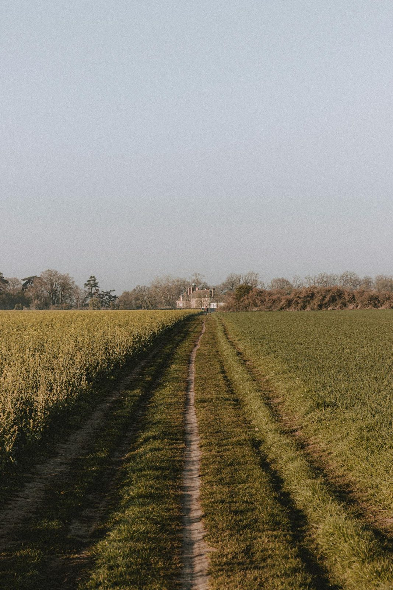

**FELLOWSHIP OF THE HEART**

*Getting Started series — The Four Connects*

Week 13

**What Was Prepared for You**

*Connecting with Mission — uphill, downhill, and the works prepared beforehand*

**COMPANION LESSON PLAN**

Pilot edition — Covenant Christian Academy of Warrenton

*Based on the Intentional Journey of the Heart (IJH), Volumes 1–6*

*John G. Tittle • Curriculum v1.4 pilot edition, August 2026*

# **Quick Reference Card**

*Print this page on cardstock. Two copies in the room. Week 13 is a turn outward — from the interior work of the prior weeks toward the question of what we were made for.*

## WEEK 13 — WHAT WAS PREPARED FOR YOU (75 minutes)

**Aim.** Begin Connecting with Mission. Distinguish uphill mission (what I do) from downhill mission (what I am). Each participant identifies gifts, passions, and one downhill answer to: “What does the room get when I show up at my best?”

**Anchor scripture.** Ephesians 2:10 — “For we are his workmanship, created in Christ Jesus for good works, which God prepared beforehand, that we should walk in them.”

**Connect focus.** Mission, primary. The first three connects (Self, Others, God) have been the work of Weeks 2–11. Tonight begins the fourth.

**Mode.** Shared teaching of the uphill/downhill distinction; SPLIT into family clusters — two or three whole families with a Cluster Companion, own family always together — for two paired exercises (Gifts and Passions inventory; Downhill Mission question); MERGE for closing. (If total attendance is about ten or fewer, skip the clustering — the whole room stays as one circle.) The Leader Feedback Round runs just before the final blessing.

**Center.** Two paired exercises in family clusters. (1) Gifts and Passions: where am I alive, what comes naturally, where do others tell me I have something to offer? (2) Downhill Mission: what does the room get when I am at my best, not performing? Each participant names one downhill answer to the cluster — a parent naming theirs first (arranged before the session), teens choosing their own depth after, and family members free to speak to what they have seen in each other.

**Between-session practice.** Take one specific small action this week aligned with what you heard in your downhill mission. One thing. Journal what happens.

**IJH source.** Vol 2 Fifth Exploration (Connecting with Mission, the four Connects sequence); Bilgere’s uphill/downhill distinction integrated into IJH Vol 2; Vol 5 Bramer (cognitive/affective/psychomotor integration as practice grounding).

## WATCH FOR (Week 13 specific risks)

- Career-talk drift. “What do you want to do for a living?” Mission is bigger than career and not the same as career. Frame this explicitly.
- Performance instincts. Senior teens and parents will be tempted to give the polished, college-essay version of their gifts. Push for specificity.
- The teen who says “I don’t have any gifts.” This is rarely true and often the inversion of pride. Honor it; do not rescue. Ask the cluster: “What do the rest of us notice about [name]?”
- The parent who turns the exercise into vocational guidance for their teen across the circle. Tonight is your own mission, not your kid’s.
- The shadow-mission detection. From Vol 2: every genuine calling has a shadow mission — the same gifts, opposite direction, self-serving. The downhill question is the surest revealer of which one is operating. Honor what surfaces; do not rush.
- The senior who already knows their mission and presents a polished answer. Affirm, then ask the harder question: “What does the room get when you’re not performing that mission — just being you?”
- Drift into uphill talk only. The exercise is two-part. The downhill question is the more formative half; do not let the gifts inventory consume the time.

## CRISIS CONTINGENCIES (Week 13)

*Week 13 is low-to-moderate risk. The most likely heavy material: a participant realizing they have spent significant life-energy on shadow mission rather than real mission. This is not a crisis; it is a turning. Receive without alarm.*

**If a teen surfaces that they feel they have no gifts and seems anxious.** Affirm: “You do. You may not have language for them yet. Tonight we ask the cluster to help.” Invite the cluster to name what they see. Brief warm follow-up within the week.

**If a parent surfaces deep mid-life vocational grief.** Honor it. Do not promise resolution. Pastoral 1:1 within the week if welcomed.

**If a participant resists the entire premise (“this is just career stuff, I came here for spiritual things”).** Receive the resistance. Re-frame briefly: “Mission in scripture is what God prepared us for. It is bigger than career. Stay with the downhill question — what does the room get when you’re at your best? That is the spiritual question.”

**Default:** Section 6 of the Handbook covers anything that crosses the safety threshold.

# **Session at a Glance**

## **Why this session, this week**

Week 1 named the four Connects. Weeks 2–4 were Self. Weeks 5–6 were Others. Weeks 7–11 were God. Tonight is Mission. The sequence matters — Vol 2 names Self→Others→God→Mission as a causal sequence with directional dependencies. Mission asked of someone who has not done the first three connects produces activity without fruit. Mission asked of someone who has done the first three connects produces walking-in-what-was-prepared.

Ephesians 2:10 is the architecture: the works are prepared. We do not invent them; we walk into them. The uphill mission is what we do with goal and plan. The downhill mission is what we are when we are most ourselves and most aligned with the Spirit. The downhill question is often the more formative — because the downhill is where the gifts already flow without effort, which is where what was prepared for us is most likely already operating.

This is also the beginning of the series’ close. Tonight we open the question; next Wednesday a second-running evening puts another teen in the lead; then the Rhythm week (Week 15) grounds what was opened and builds the long walk; and at the year’s end, the sending and the commissioning. The architecture is intentional.

## **Dependencies**

## From prior sessions

- Weeks 2–4: Self — the soil and the story. Tonight’s gifts inventory rests on what each participant has already named about themselves.
- Weeks 5–6: Others — the four conditions and confession. Tonight asks: where in this room have we already seen each other’s gifts? The room can speak now in ways it could not have in Week 1 — and tonight, families speak to each other’s gifts inside their own cluster.
- Weeks 7–11: God — PROAPT, the garden, the doubts. Tonight’s downhill question requires a participant who can listen for what God says about them, not just what they say about themselves. Without that, the exercise becomes self-help.
- All three Connects feed into tonight. If any participant is still stuck in Self-work, the Cluster Companion may need to pace them gently — the Mission question lands differently when Self is unfinished.

## **Connect focus**

Mission, primary. Self provides the inventory; Others provides the witness; God provides the calling. Mission integrates all three.

# **Pre-Work for the Companion Team (this week)**

## **Personal pre-work**

Each Companion answers two questions for themselves before this session.

Question one — Gifts and Passions. Where am I alive? What comes naturally to me? Where do others (specifically: my closest friends, my spouse if I have one, my brothers/sisters in faith) tell me I have something to offer? Pick the three answers that are most true. Be specific.

Question two — Downhill Mission. When I am at my most genuinely myself, not performing, not managing my image, just present and open — what do the people around me get to be? What does the room feel like? This question, from Vol 2, is closer to your downhill mission than any mission statement you have labored over.

Sit with both questions for at least thirty minutes alone this week. Do not skip. The Companion who has not personally articulated their own downhill mission cannot help another person articulate theirs.

Optional but powerful: ask one trusted person who knows you well — spouse, close friend, mentor — to answer the downhill question about you. “When I am at my best, not performing, what does the room get?” Their answer often differs from yours in instructive ways.

## **Team pre-work**

The Thursday Call's look-ahead before Week 13 covers:

1. Each Companion briefly names their own downhill answer to the circle. The team listens. Nobody comments — just witnesses.
2. Walk the cluster exercise structure (below), and arrange the parents-first openings: for each family cluster, ask a parent ahead of time to open both sharing rounds — the gifts round and the downhill round. Never a cold call on a teen.
3. Identify any participant the team is watching for. Most relevant tonight: anyone whose Self/Others/God work is still unfinished, anyone whose Week 9 or 8 surfaced significant material.
4. Confirm pastoral / clinical backup.
5. Pray for each participant by name, specifically for what was prepared for them.

## **Logistics pre-work**

1. Print the Gifts and Passions inventory (Handout H13.1).
2. Print the Downhill Mission card (Handout H13.2).
3. Print the between-session practice card (Handout H13.3).
4. Confirm pastoral / clinical backup availability.
5. Begin printing for Week 21 — Family Commissioning. (Some Week 21 prep takes lead-time; see Week 21 plan.)

# **Materials and Setup**

### **Materials checklist**

- Chairs in main room as single circle for opening.
- Personal Heart Journals.
- Whiteboard with two columns pre-drawn: UPHILL (what I do) and DOWNHILL (what I am).
- Handouts H13.1, H13.2, H13.3 stacked at each chair.
- A private space for each family cluster — two or three whole families with their Cluster Companion. (If total attendance is about ten or fewer, skip the clustering; the whole room stays as one circle.)
- Tissues in every cluster space.
- Large-print Bible (ESV).
- Wall clock or visible timer in each cluster space.
- Crisis Quick-Reference Card.
- Pastoral / clinical backup on call.

### **Pre-session preparation timeline**

| **When** | **Action** | **Who** |
| --- | --- | --- |
| Week before | Each Companion answers the two pre-work questions. Print all handouts. | All Companions |
| Day before | Walk every space. Whiteboard columns drawn. | Lead Comp |
| T-20 min | Team gathers off the room (the room is the school’s until 4:00). Each names their own downhill answer briefly. Pray for each participant. | All Companions |
| 4:00 | School day ends. Team + teen room-build crew enter: whiteboard columns up, handouts at each chair, cluster spaces prepped. Families greeted as the room builds. | Team + crew |
| 4:15 | Room built. Lead Companion opens. | Lead Comp |

# **Detailed 75-Minute Run Sheet**

*Times below assume a 4:15 PM start. School releases at 4:00; the room is built by many hands in the first fifteen minutes. Adjust to your start time but keep the durations.*

| **Time** | **Block** | **Mode** | **Lead** | **Notes** |
| --- | --- | --- | --- | --- |
| 4:00 | School day ends. Team + teen room-build crew enter (crew named on the Weekly Run Card): chairs to circle, crate opened, handout folders out, screen up. | — | Team + crew | 15 |
| 4:00 | Families arrive while the room builds — greeted by name; helping hands welcome. | Open | All Companions | Door, name tags. |
| 4:15–4:22 | Block 1: Welcome and centering | Shared circle | Lead Comp | Aaronic blessing. Brief container reminder. Frame Week 13 as the turn outward. |
| 4:22–4:26 | Block 2: Week 11 check-in | Shared circle | Lead Comp | Brief check on Doubts Inventory. One-sentence shares. |
| 4:26–4:36 | Block 3: Ephesians 2:10 and the uphill/downhill distinction | Shared circle | Lead Comp | Read scripture. Walk both columns on whiteboard. Demo with own downhill answer. |
| 4:36–4:37 | Block 4: Bridge to split | Shared circle | Lead Comp | Frame the two exercises. Pray. Split. |
| 4:37–5:17 | Block 5: Gifts and Downhill in family clusters | Family clusters | Cluster Comps | Two paired exercises, ~20 minutes each, a parent opening each sharing round. The downhill round closes with each person naming their answer to the cluster. |
| 5:17–5:19 | Block 6: Merge and surface | Shared circle | Lead Comp | One general observation per cluster, named by the Cluster Companion — a sentence each. Then a brief observation across the room. |
| 5:19–5:22 | Block 7: Between-session practice and closing-weeks logistics | Shared circle | Co-Comp (Parent) | One small action. Then the road ahead: Wk 15 Rhythm, Wk 21 family commissioning (bring family), Wk 22 Companion commissioning. |
| 5:22–5:26 | Block 8: Leader Feedback Round | Shared circle | Lead Comp | Section 11.7. Four minutes, just before the blessing. |
| 5:26–5:30 | Block 9: Closing container | Shared circle | Lead Comp | Reaffirm. Aaronic blessing. |

# **Block-by-Block: Scripts and Notes**

## **Block 1 — Welcome and Centering (4:15–4:22, 7 min)**

## Script

*“Welcome back. Settle.”*

*“The Lord bless you and keep you; the Lord make His face shine on you and be gracious to you; the Lord turn His face toward you and give you peace.”*

*“Tonight is Week 13. The first eleven weeks were what scripture calls a turning inward and upward — the soil of our hearts, our story, our friendships, our doubts, our garden encounters with Jesus. Tonight we turn outward. The question is: what was prepared for us to do, and to be?”*

*“Container reminders: what is said here stays here. Nothing is required.”*

## **Block 2 — Week 11 Check-in (4:22–4:26, 4 min)**

## Script

*“Before the break we did Any Doubts?, and last week at The Return we saw what the break did with our practices. The practice carried across was the Personal Doubts Inventory. Anyone want to say one sentence about how that landed — the inventory, or anything that surfaced, or that you didn’t get to it?”*

*(A parent you arranged with before the session offers the first sentence — never a cold call on a teen. Then take 2–3 more voluntary contributions. Receive without commentary.)*

## **Block 3 — Ephesians 2:10 and the Uphill/Downhill Distinction (4:26–4:36, 10 min)**

Stand near the whiteboard. Read the scripture. Walk both columns. Demo with your own downhill answer at the end.

## Script (the read)

*“Our scripture tonight is one verse, and it is the architecture of the night. Ephesians 2:10. Listen.”*

*“For we are his workmanship, created in Christ Jesus for good works, which God prepared beforehand, that we should walk in them.”*

— Ephesians 2:10 (ESV)

### **Teaching points (use any format — do not read this verbatim)**

• Notice what the verse says and does not say. The works were prepared. Not by us. Not for us to invent. Prepared, beforehand. Our job is to walk in them. Walking is not engineering; it is movement into something that already exists.

• Most of the mission language we hear in church is uphill language. ‘What’s your calling? What’s your mission statement? What are you going to do with your life?’ These are real and important questions, but they are the smaller half of mission. The bigger half is downhill.

• (Walk to the whiteboard. UPHILL column.) Uphill mission is what I do. It has a goal, a plan, measurable steps. ‘I want to teach math.’ ‘I want to start a non-profit for foster kids.’ ‘I want to write songs that help people pray.’ These are uphill missions. They require effort to climb toward. They are good and they are real.

• (DOWNHILL column.) Downhill mission is what I am. It is the effect I have on the people around me when I am most aligned with the Spirit and most genuinely myself. When I am not performing, not managing my image, just present and open — what do people around me get to be? What does the room feel like? That is the downhill mission. It flows; you don’t have to push it.

• The works were prepared. Walking-in-what-was-prepared sounds a lot more like downhill than uphill. The uphill work is real, but most of it is clearing the blockages so that the downhill becomes possible. We have spent eleven weeks on the uphill clearing. Tonight we ask the downhill question.

• Here is the test, from Vol 2. When I am at my most genuinely myself — not performing, not managing, just present and open — what do the people around me get to be? Answer that, and you are closer to your downhill mission than any mission statement you have labored over.

## Lead Companion demo (90 sec)

*“Here is mine. Brief, honest, not polished. When I am most genuinely myself, what people seem to get is \_\_\_\_\_. (Specific. One sentence. Not ‘I help people.’ Not generic. The specific thing the room gets.) That is closer to my downhill answer than any uphill plan I’ve had.”*

*Watch for: be brief and be specific. The teens will calibrate against your honesty. Do not give the resume version. Give the version your spouse would recognize.*

## **Block 4 — Bridge to the Split (4:36–4:37, 1 min)**

## Script

*“Two exercises in your family cluster. About forty minutes total.”*

*“First: Gifts and Passions. About twenty minutes. Each of you, working alone with H13.1 for ten minutes, then sharing what you wrote with your cluster for the next ten. Where are you alive? What comes naturally? Where do others tell you you have something to offer?”*

*“Second: Downhill Mission. About twenty minutes. Each of you sits with H13.2 for five minutes alone, then names your answer to the cluster. One sentence. ‘When I am at my best, what the room gets is \_\_\_\_\_.’ In each round a parent goes first — we arranged that this week; teens, you choose your own depth, and passing holds. The cluster listens and may add what they have noticed — and in a family cluster that includes your own family: a parent may speak to a teen’s gifts, and a teen to a parent’s. We close with each person having named one downhill answer.”*

*“Pray with me. Father, you prepared works for each of us beforehand. Help us name what you have already given us. Show us where we are alive. Show us what the room around us gets when we are most ourselves and most yours. Amen.”*

*“Family clusters: [name each cluster’s families and its Companion]. Forty minutes. Go.”*

## **Block 5 — Gifts and Downhill in Family Clusters (4:37–5:17, 40 min)**

Each family cluster runs in parallel. The structure inside each cluster is identical. (When the whole room stays as one circle — attendance about ten or fewer — the Lead Companion holds this same structure for the room.)

### **Inside the family cluster — Companion script**

## Opening (90 sec)

*“Two exercises tonight. Twenty minutes each. The first is a quiet inventory; the second is the more formative one. We move from inventory to the room.”*

*“Same container rules. What’s said here stays here. Specificity is the practice.”*

## Phase 1 — Gifts and Passions (≈20 min)

**Quiet writing time (10 min). Each person works H13.1 in their journal alone. Cluster Companion works it too.**

**Sharing round (10 min). Each person 60 seconds. “The three things I noticed are \_\_\_\_\_. The one I’m most surprised by is \_\_\_\_\_.” The parent arranged before the session goes first — never a cold call on a teen; teens choose their own depth after. Pass anytime. The Cluster Companion does not summarize. After each share, the cluster can affirm what they’ve seen — briefly. “Yes — we see that in you. Specifically: \_\_\_\_\_.” Family members may speak to each other’s gifts here; a parent’s specific word about their own teen, or a teen’s about their own parent, often lands deeper than anyone else’s.**

## Phase 2 — Downhill Mission (≈20 min)

**Quiet writing time (5 min). Each person works H13.2 alone. The question: “When I am at my most genuinely myself, what does the room get?” One sentence. Specific.**

**Sharing round, by name, around the circle (15 min). Each person 90 seconds.**

**Step 1 (the participant): “What I noticed is that when I’m at my best, what the room gets is \_\_\_\_\_.” Specific. One or two sentences.**

**Step 2 (the cluster): One or two voices add what they have noticed in this person across Getting Started. “What I’ve seen in you is \_\_\_\_\_.” Specific. Brief. Not vague affirmation — something concrete the cluster has actually seen. In a family cluster this includes — especially — each other’s family: a parent naming what the room gets when their teen is at their best, or a teen naming it for a parent. Keep it specific and brief; do not invent beyond what has actually been seen.**

**Step 3 (the Cluster Companion): briefly affirms and moves to the next person. Do not over-process. The naming is the gift.**

**The arranged parent goes first — never a cold call on a teen. Teens choose their own depth after; pass-anytime holds.**

### **Cluster Companion: when to intervene**

- If a participant’s downhill answer is generic (“I help people”, “I care about others”), gently push: “What’s the more specific version of that? When you’re helping people — what specifically does the person you’re helping get to be?”
- If a participant says “I don’t know” and seems anxious about it, ask the cluster: “What have we noticed about [name] across Getting Started?” Have two or three voices contribute — family first, when the family has words. The participant adopts what fits.
- If a participant performs a polished mission statement, redirect: “That sounds like an uphill answer. What’s the downhill version — what does the room get when you’re not running the mission, just being you?”
- If the cluster’s witness step drifts into general flattery (“you’re so kind”), redirect: “Can you say what specifically you’ve seen — a moment, an instance, a quality you’ve noticed across Getting Started?”
- If a participant surfaces grief (“I realized I have not been doing this for years”), receive without rushing. The grief is part of the recognition. Bless it. Move on gently.
- Watch the time. The downhill round is the more formative; if you have to compress, compress the gifts inventory, not the downhill.

## **Block 6 — Merge and Surface (5:17–5:19, 2 min)**

*This block runs two minutes in the 75-minute pilot edition — it gave five to the Leader Feedback Round (Block 8) and the rest to the shortened afternoon. Keep the Companion observations to a sentence each.*

## Script

*“Welcome back. Take a breath.”*

*“What was named in your cluster stays in your cluster. So I am not going to ask anyone to repeat their downhill answer. I am going to ask each Cluster Companion for one sentence — one general thing they noticed about their cluster, not a specific person. Then one observation from me.”*

*(Each Cluster Companion names one general observation, 30 seconds each.)*

*“What I notice across the room is \_\_\_\_\_. (Be specific and brief. Often: ‘Many of you described what the room gets in similar terms — honesty, presence, courage. The downhill mission is more shared than we might guess.’ Or: ‘There is a striking specificity in this room tonight that wasn’t there in Week 1.’ Whatever the actual observation is.)”*

*“One thing to remember. The downhill mission you named is not a final answer. It is the working draft you are walking in this season. It will deepen. It will sharpen. But what you named tonight is closer to true than the resume version, and the room can witness it.”*

## **Block 7 — Between-Session Practice and Closing-Weeks Logistics (5:19–5:22, 3 min)**

## Script

*“Two things before we close.”*

*“First, the practice this week. One small action, aligned with your downhill answer. One. This week. Not a campaign. One specific thing. If your downhill answer is ‘the room gets honest with each other when I show up,’ maybe you say something true to someone this week you would normally have edited. If your downhill is ‘the room gets calmer when I show up,’ maybe you sit with a friend in distress this week instead of trying to fix them. Specific. Small. This week.”*

*“Your Personal Heart Journal has Week 13 pages. Handout H13.3 is the practice card.”*

*“Second — the road from here. Next Wednesday, Week 15, is the Rhythm week: we build the practices you will carry when the Wednesdays stop, and we finish tonight’s mission work. Then Week 21 is the family commissioning — bring your whole family, even family members who have not been here. Spouses, siblings, grandparents who can come — invite them. And Week 22 is the commissioning of our Companions-in-Formation — the seniors who have been leading us. That one is their night; come to witness it.”*

*“For the Week 21 commissioning: we run to 6:15 that week, not 5:30 — the one night we extend. Light food from 4:00 as the room builds. Details are coming in an email.”*

*(Adjust the specifics above to your actual closing-weeks plan if it differs.)*

## **Block 8 — The Leader Feedback Round (5:22–5:26, 4 min)**

*The evening's leader closes the working part of the evening the same way every week.*

Leader: *“Before we close — three things from me, same as every week. What I think went well tonight: ______. What I’d do differently next time: ______. If I were to teach tonight’s process to someone, I would tell them: ______. Now the room — same two questions about tonight. What went well? What would you do differently?”*

Two or three voices on each question is plenty. The leader receives without defending — “thank you” is the whole response. If a teen led tonight, they answer first, the adult second; the room’s feedback covers them both.

*(The leader may drop this round if the room's energy needs something else. Dropping it twice running goes to the team debrief.)*

## **Block 9 — Closing Container (5:26–5:30, 4 min)**

## Script

*“What was named tonight in your cluster is yours. Carry it gently. The downhill answer you named will keep deepening across the week.”*

*“If anything that surfaced tonight feels heavier than tonight could hold — if you noticed a place you have been spending energy on shadow mission rather than real mission, or if mid-life vocational grief surfaced — please reach out. The team is walking with you, especially this week, especially before next Wednesday.”*

*“Aaronic blessing. Hands up if you want.”*

*“The Lord bless you and keep you; the Lord make His face shine on you and be gracious to you; the Lord turn His face toward you and give you peace.”*

*“See you Wednesday — 4:15 — with your family.”*

# **One Band, Whole Families: Notes for Teens and Parents**

*Getting Started runs as a single high-school band, and tonight's clusters hold whole families. The inventory (H13.1) has a teen version and a parent version — the same work, in two registers.*

## **Teens (high school)**

## Notes

- Gifts and Passions inventory uses full prompts (where you come most alive, what others tell you you do well, what you would do without being paid). See Handout H13.1 (teen version).
- Teens are the most likely to have already constructed a polished college-essay version of their gifts. Push for the unpolished, downhill version.
- Watch for: the teen with a mission statement. Affirm; ask the harder question: “When you’re not running that mission — just being you — what does the room get?”
- Watch for: the teen facing college decisions and wanting tonight to give vocational direction. Re-frame: “Tonight is bigger than what you study. What will be true of you on a Wednesday afternoon ten years from now? That’s the downhill question.”
- Watch for: the teen whose downhill answer reveals shadow mission (gifts directed inward, performance-shaped). The Cluster Companion names this gently if it surfaces clearly: “What I want to bless is the gift. The shadow direction is yours to keep watching in Going Deeper.”
- Watch for: the teen who can’t name a single gift, or who performs modesty (“I don’t really have any gifts”). The cluster is the gift here — and family first: “[Parent’s name], what have you seen?” A parent’s specific word often lands where anyone else’s cannot. Affirm: “Tonight isn’t bragging. It’s noticing what God put in.”

## **Parents**

## Notes

- Gifts and Passions inventory uses adult prompts (where you come alive in midlife, what your closest friends say you do well, what would be true of you across vocations). See Handout H13.1 (parent version).
- Parents open both sharing rounds in their cluster — arranged before the session. A parent doing this work honestly, in front of their own teens, is half of what tonight teaches.
- Parents may surface grief about gifts they have not used in a long time, or seasons of shadow mission. This is part of the work. Honor without rushing.
- Watch for: the parent who frames mission as career. Re-frame: “Mission in scripture is bigger than work. What does the room get when you’re at your best, regardless of what you’re paid to do?”
- Watch for: the parent who steers their teen’s answers instead of doing their own work. Gently: “Tonight is your own mission. Your teen’s is theirs to name — you’ll get your chance to witness it in the round.”
- Watch for: the parent whose downhill answer involves their family (“when I’m at my best, my kids get \_\_\_\_\_”). This is real — and tonight the kids are in the circle to hear it. Honor it; it is often the evening’s quietest heavy moment.
- Watch for: the parent who realizes mid-exercise that their primary downhill mission for the last fifteen years has been parenting, and is approaching the threshold where that season changes. This is appropriate; the next downhill mission is part of what tonight begins to surface.
- Watch for: the parent with mid-life vocational grief. Pastoral 1:1 within the week if welcomed.

# **Closing Practice in Detail**

Same three-layer pattern. Tonight’s closing carries a logistical weight (Week 21 framing) that the prior weeks have not had. Be explicit and warm about Week 21. Some participants will not realize until the closing how seriously the team is treating the family commissioning. The Leader Feedback Round sits just before the blessing, brief and steady, same as every week.

# **Between-Session Practice**

## What we are practicing this week

- The morning question (5 min, daily) — carried forward.
- The evening journal note (1–2 min, daily) — carried forward.
- Personal Doubts Inventory (carry forward as a living practice; not new this week).
- One small action aligned with downhill mission (NEW this week). One specific thing. This week. See Handout H13.3.

Note: this week’s practice is the smallest of Getting Started. Resist the urge to inflate it. The point is one specific small action that is shaped by what was named tonight. The goal is to walk in what was prepared, not to launch a project.

# **Companion Debrief Prompts**

Companion team debriefs Week 13 in the look-back of the Thursday Call (Handbook Section 3). Plus an additional 60 minutes specifically on Week 21 logistics (the commissioning is the most logistically complex session of Getting Started).

### **Signs the session worked**

- Each participant in each cluster named at least one specific downhill answer.
- The cluster’s witness step contributed specific, concrete observations — not generic affirmations — including family members speaking to each other’s gifts.
- At least one participant left visibly clearer about something they had been carrying loosely before.
- The merge surfaced a pattern — the room is more specific than it was in Week 1.
- Participants are visibly preparing for Week 21 (asking about logistics, talking about who’s coming, rehearsing what they want to say).

### **Signs the session did not work as well as it could have**

- Downhill answers were generic or unchanged from Week 1’s self-introduction language.
- The exercise became a discussion of careers and college plans.
- The cluster’s witness step gave only flattery.
- The teaching block ran long; the cluster work ran short.
- Week 21 logistics weren’t framed clearly and participants left uncertain about who to bring.

### **If the session did not work — what to adjust for Week 21**

- If downhill answers were generic, re-touch at Week 15's opening — the Rhythm session completes any unfinished mission work by design: “Some of you wrote downhill answers in the Mission week that have probably deepened since.” The deepened answers then carry into the Week 21 commissioning.
- If logistics weren’t clear, send a follow-up email Wednesday with the Week 21 specifics.

### **People to follow up with this week**

- Anyone whose downhill question seemed to surface significant grief or shadow-mission recognition.
- Any parent facing mid-life vocational uncertainty.
- Any senior teen who is in the middle of college decisions and seemed activated by tonight.
- Anyone who could not name a single gift and seemed troubled by it.
- Anyone whose family member is hesitant to come to Week 21 — the team’s warm invitation may be needed.

# **Handouts**

Three handouts for Week 13.

- H13.1 — Gifts and Passions Inventory (teen and parent versions)
- H13.2 — Downhill Mission Card
- H13.3 — Between-Session Practice (one small action this week)

**Handout H13.1 — Gifts and Passions Inventory**

*Ten minutes alone with these prompts. Two versions on this page — teens use the teen version; parents the parent version. Be specific. “I’m good with people” is not specific. “I’m the one my friends call when they’re crying at midnight” is specific.*

## **Teen version (high school)**

## Inventory prompts

**1. Where do you come most alive? Be specific. (Not ‘sports’ — the specific moment in the specific sport. Not ‘school’ — the specific subject in the specific kind of project.)**

**2. What comes naturally to you that doesn’t seem to come naturally to others? (Specifically. Not ‘leadership.’ The specific kind of leadership.)**

**3. What do your closest friends, your family, or a trusted teacher tell you you have to offer? Be specific. Whose words are these?**

**4. What would you do in a calling, regardless of pay? (Not ‘help people’ — the specific kind of help.)**

**5. What is a thing about you that you think might be a gift but you have not yet had words for?**

**6. Pick the THREE most-true items from your list. Star them.**

**7. Of those three, which one are you most surprised by? Underline it.**

## **Parent version**

## Inventory prompts

**1. In midlife, where do you come most alive? Where does the energy still move easily?**

**2. What does your spouse, your closest friends, or a long-time mentor tell you you do well — specifically? Whose words are these?**

**3. What capacity do you have at this age that you did not have at twenty-five? Where has fruit appeared?**

**4. What would be true of you across vocations — the gift that has shown up in your work, in parenting, in friendship, in church?**

**5. What is a gift you have been quietly using without naming, sometimes for decades?**

**6. What is a gift you have not been using — something that felt true once and has become quiet?**

**7. Pick the THREE most-true items from your list. Star them.**

**8. Of those three, which one are you most surprised by, or most wishing you had named years ago? Underline it.**

**Handout H13.2 — Downhill Mission Card**

*Five minutes alone. Then you’ll name your answer to your family cluster.*

## The downhill question

**When I am at my most genuinely myself — not performing, not managing my image, not running a plan, just present and open — what do the people around me get to be? What does the room feel like?**

### **How to find your answer**

- Think of a recent time you were unmistakably yourself — not performing for anyone. The conversation that lasted past midnight; the moment you laughed without managing it; the time someone said ‘you’re really yourself right now.’ Picture that scene.
- In that scene, what were the people around you getting? Permission to be honest? Calm? Courage? Joy? Specifics, not categories. ‘Permission to laugh at themselves’ is more specific than ‘joy.’
- Ask: would the people who know me best recognize this answer? If they wouldn’t — it’s probably the resume version, not the downhill version.
- Test: does the answer sound like an action you do, or a quality the room gets? Downhill is the second.

### **Write your answer below — one sentence**

“When I am at my most genuinely myself, what the room gets is \_\_\_\_\_.”

### **If you can’t find one**

That is fine. The cluster will help — often your own family first. Some of us see ourselves more clearly through other people’s eyes than our own. That is what witnessing community is for.

## Caution — the shadow

*From Vol 2: every genuine calling has a shadow mission. Same gifts; opposite direction. The shadow draws inward (collecting people in service of self), while the real mission goes outward (serving people beyond yourself).*

*If the answer you find is mostly about what people give you (recognition, attention, identity), watch — you may have found the shadow rather than the downhill. Both feel like passion from the inside. The downhill mission goes out.*

**Handout H13.3 — Between-Session Practice (Week 13)**

## This week’s practice — one small action

**One specific small action this week, aligned with what you named in your downhill answer.**

**Just one. Not a campaign. Not a new schedule. One thing.**

### **Examples**

## If your downhill answer is...

**“What the room gets is permission to be honest.” → This week, in one specific conversation, say one true thing you would normally have edited.**

**“What the room gets is calm in something hectic.” → This week, sit with one friend or family member who is in distress, without trying to fix.**

**“What the room gets is courage to ask the next question.” → This week, ask one question you would normally not ask of someone you know well.**

**“What the room gets is joy.” → This week, with one specific person, do not edit your delight when you see them. Let it land.**

**“What the room gets is welcome.” → This week, notice one person who is on the edge of a room you walk into, and welcome them specifically by name.**

### **Then journal**

After the action, write three or four sentences in your Personal Heart Journal:

- What did I do, specifically?
- What happened in the other person, in me, in the room?
- What did I notice about myself when I was walking in this gift on purpose?
- What is one thing I want to bring into Week 21’s commissioning?

**Handout H13.4 — This Week’s Practice — the Check-Off Card**

*Take this card home — fridge, mirror, journal pocket. One check per completed practice. The journal stays reflective; this card is just the checkmarks — a small sense of done each day, and a gentle nudge back when a day slips. A missed box is never a failure; it is an invitation to return.*

| Practice | Thu | Fri | Sat | Sun | Mon | Tue | Wed |
| --- | --- | --- | --- | --- | --- | --- | --- |
| The morning question (5 min) | ☐ | ☐ | ☐ | ☐ | ☐ | ☐ | ☐ |
| The evening journal note (1–2 min) | ☐ | ☐ | ☐ | ☐ | ☐ | ☐ | ☐ |

**This week’s one-time practices (check when done):**

- ☐ One small action aligned with your downhill answer — then three or four journal sentences on what happened
- ☐ The Personal Doubts Inventory, kept alive — revisit or add to it once (not new this week)

*Filled or half-filled, bring yourself back Wednesday. The room is the practice too.*
