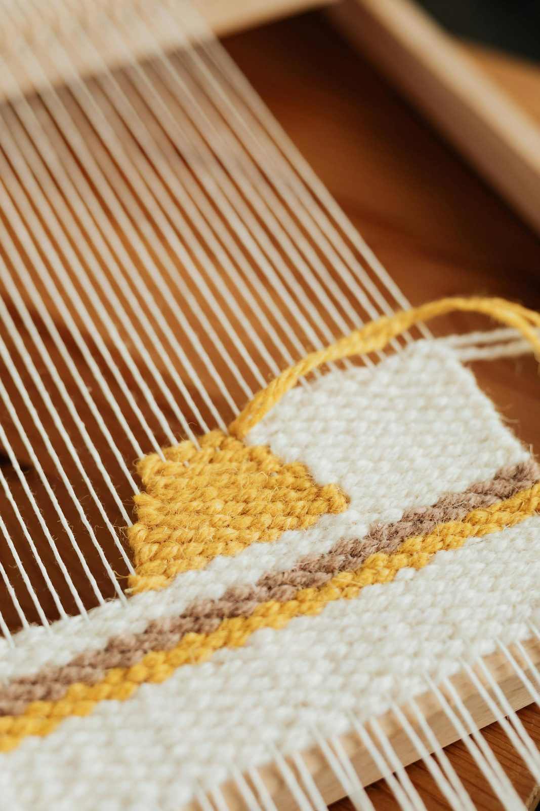

**FELLOWSHIP OF THE HEART**

*Going Deeper series*

Week 4

**Co-Processing in the Room**

*Making the corporate mechanism visible — and using it on purpose*

**COMPANION LESSON PLAN**

*Pilot edition — Covenant Christian Academy of Warrenton*

*Based on the Intentional Journey of the Heart (IJH), Volumes 1–6*

*John G. Tittle • Curriculum draft v1, May 2026*

**Quick Reference Card**

*Print this page on cardstock. Two copies in the room. Wk 4 is the first whole-room working session of Going Deeper. The room itself is the practice tonight; the teaching about co-processing only lands if the cohort experiences it as it is being named.*

## WEEK 4 — CO-PROCESSING IN THE ROOM (90 minutes)

**Aim.** Teach the corporate mechanism by which a group session produces formation across the whole cohort, not only in the participant whose work is visible. Demonstrate it twice. Then ask each participant to name what surfaced in them in parallel.

**Anchor scripture.** 1 Corinthians 12:12–27 (one body, many members); Ecclesiastes 4:9–12 (two are better than one).

**Connect focus.** Others (deepened). The first true Others-deepened session of Going Deeper.

**Mode.** Whole-room. No cohort split tonight. The whole cohort sits as one circle. Two short volunteer pieces of work are demonstrated; the room co-processes silently.

**Center.** Two participants — one teen, one parent — bring a short piece of their named knot from Wk 3 (≤8 minutes each) into the centre of the circle, supported by the Lead Companion. The rest of the room co-processes silently. After each piece, voluntary one-sentence shares about what surfaced for the silent participants in parallel.

**Between-session practice.** Standing-pair check-ins continue (3 brief). Daily 5-minute notice of the named knot continues. New this week: one Co-Processing Journal entry — what surfaced in YOU when someone else's work was visible tonight.

**IJH source.** Vol 2 Exp 9 (Community as Amplifier — the Law and the Danger, 80% confidence); Vol 2 Exp 8 (Container conditions); Vol 1 Exp 1 (the hearing chain in corporate context).

## WATCH FOR (Week 4 specific risks — read twice)

*This is the first whole-room working session of Going Deeper. The risks are mostly about how the room holds two people doing visible work while everyone else is asked to be active rather than spectatorial.*

**Spectator drift. The hardest move tonight is shifting the silent participants from spectator mode (‘watching this thing happen to that person’) to co-processor mode (‘the same Spirit is also at work in me right now’). The teaching frames it; the surfacing-rounds enforce it.**

**The volunteer who flips into therapy mode. The volunteers were briefed; the Cohort Companion confirmed in advance that the piece is right-sized for an 8-minute demonstration. Watch the Lead Companion gently containing the work if it tries to expand.**

**The room treating a volunteer’s vulnerability as performance. The applause instinct is real and the Lead Companion must shut it down at the start: ‘We do not applaud each other in here. We bear witness in silence.’**

**Cross-cohort exposure. Tonight a teen may see a parent doing real work; a parent may see a teen doing real work. This is intended, but it carries weight. Watch for any teen whose own parent’s visible work activates them; same in reverse. The Cohort Companion reads the room.**

**The participant who keeps quiet through both surfacing rounds. Some are processing; some are dissociating. The Cohort Companion notices both kinds without intervening publicly. Offline contact within 48 hours where appropriate.**

**The participant who immediately wants to volunteer mid-session. ‘I have a piece I want to bring right now.’ The Lead Companion: ‘Hold it. Bring it to your standing pair this week. Wks 7 and 8 will offer corporate prayer in a more held form.’**

**The new participant who has not yet named a knot. Wk 4 may be the first session where they realize they have not yet completed Wk 3’s diagnostic. Cohort Companion follows up offline within the week; encourage the named-knot work via standing pair before Wk 5.**

## CRISIS CONTINGENCIES (Week 4)

*Crisis risk is moderate. The held nature of the demonstration (volunteers pre-briefed, Lead Companion in the centre, pieces right-sized in advance) lowers risk for the volunteers. The risk is more diffuse — a silent participant flooded by what the volunteer’s work activated.*

**If the volunteer goes deeper than the room can hold. The Lead Companion gently closes the work: ‘We are going to pause here. The deeper work is for the standing pair this week and pastoral 1:1 if that is right.’ Do not push through. Pastoral / clinical backup notified that night.**

**If a silent participant flips into flooding (cannot stop crying, freezes, leaves the room). One Cohort Companion quietly follows them; the rest of the room continues. Do not interrupt the centre work to retrieve the flooded participant. After: 24-hour contact protocol; pastoral 1:1 within the week.**

**If a silent participant’s surfacing share opens material larger than the surfacing round can hold. The Lead Companion receives without rushing: ‘What you just named is real. Bring it to your standing pair this week; we’ll walk with you.’ Cohort Companion follow-up within 48 hours.**

**If a teen sees a parent doing visible work and is activated mid-session. The parent’s Cohort Companion (not the teen’s) is briefed in advance to watch for this. The teen’s Cohort Companion quietly checks in at the close. Pastoral 1:1 within the week if welcomed.**

**If a parent sees their own teen do visible work. Same protocol in reverse. The parent is checked on at the close; the teen is treated as a volunteer who has done a brave piece of work, not as a child whose parent watched. Boundary discipline.**

**Default. Section 6 of the Going Deeper Handbook covers anything that crosses the safety threshold. Pastoral / clinical backup confirmed by name and number for the night.**

**Session at a Glance**

**Why this session, this week**

Vol 2 Exp 9 of IJH names community as the amplifier of formation — and warns that the same amplification works in both directions. ‘A formation community amplifies what is true and also amplifies what is false; the discipline is the container, the practices, and the willingness of the body to bear witness without taking on the weight that belongs to the Spirit.’ The 80% confidence rating reflects strong scriptural grounding (1 Cor 12, Eph 4, the Acts pattern) plus consistent observation in formation communities, with the caveat that the dynamic is harder to test than the individual-level laws.

Co-processing is the under-recognized half of how a formation room actually works. When one person’s work is visible, the rest of the room is doing the same kind of work silently — recognizing themselves in the volunteer, surfacing parallel material, having the Spirit speak into something they did not name out loud. Most participants leave a session like this feeling that something has shifted in them, and only later realize the shift was not produced by their own visible contribution.

The risk is that this happens implicitly. When co-processing is unnamed, the silent participants drift into spectator mode and the formation gain shrinks. When co-processing is named and used on purpose, the room becomes a different kind of instrument. Tonight makes it explicit, demonstrates it twice, and asks the cohort to walk it forward as a working frame for Wks 7, 8, and 10 — the corporate-listening, group-hearing, and Acts-13 calling sessions, which all rely on co-processing to do most of their formation work.

This is also the first whole-room working session of Going Deeper. The cohort split has been the architecture for Wks 2 and 3; tonight the whole cohort works as one. The shift will feel different. The Lead Companion names this explicitly at the open.

**Dependencies**

## From prior sessions

**•** Wk 1 re-installed the container and named co-processing briefly as a Going Deeper addition. Tonight is the working version of what was named there.

**•** Wk 2 (Soils) and Wk 3 (Knots and Lies) gave each participant specific diagnostic data — a named knot, a possible lie, a place where the soil is hardest. Tonight’s volunteers are bringing pieces of that data into visible work; the silent participants are co-processing on the same kind of data.

**•** Wk 3 closed with standing-pair partner assignments. Pairs have had one week of brief check-ins. Tonight builds the cohort around the pair: the pair stays; the cohort itself becomes a working unit in a new way.

**•** Hebrews 12:1–2 — ‘surrounded by so great a cloud of witnesses’ is the architectural anchor for tonight. The witnesses are not spectators; they are the cloud.

**Connect focus**

Others, deepened — the first session of the Others-deepened block (Wks 4 and 5). The room itself becomes the practice; the standing pair carries between sessions; Wk 5 brings confession into the pair. Tonight is the corporate frame inside which the more intimate pair work happens next week.

**Pre-Work for the Companion Team (this week)**

**Personal pre-work**

Each Companion does three things this week. The first two are formational; the third is operational.

First — sit with one moment from your own formation when someone else’s visible work in a group did interior work in you that you did not initiate. Specifically. Not ‘I have grown in groups’ — ‘the night Sarah named her father wound, something in me released about my own father that I was not even thinking about that week.’ Bring the specific moment to the team meeting.

Second — read 1 Corinthians 12:12–27 slowly, three times, across three days. Notice which clause is most alive for you this week — the body language of v.12, the suffering-together of v.26, the indispensable-weaker-parts of v.22. Bring the observation to the team meeting.

Third — confirm the two volunteers. The Lead Companion and one Cohort Companion have, by Saturday, identified two participants — one teen, one parent — who would bring a right-sized piece of work tonight. Each volunteer has been pre-briefed: ‘We will hold the work in the centre for about 8 minutes. We will not push to release the knot tonight; we will name what is true and stop there. The whole room will be silent witnesses.’ Both volunteers have agreed; both have rehearsed briefly in 1:1 with their Cohort Companion. The pieces are confirmed in size.

**Team pre-work**

Forty-eight hours before Wk 4, the Companion team meets for sixty minutes. The duration is unusual; the whole-room session and the volunteer pieces require careful pre-coordination.

**1.** Each Companion names the moment they identified in personal pre-work. The team listens. (15 min)

**2.** Each Companion names which 1 Cor 12 clause is most alive. (5 min)

**3.** Volunteer review. The two volunteers are named to the whole team. The Cohort Companion who pre-briefed each volunteer summarizes the piece they will bring, in confidence, in front of the rest of the team — so every Companion knows what is coming and can support the room around it. (15 min)

**4.** Walk the run sheet. The whole-room layout is unfamiliar; cohort spaces are not in use tonight. Confirm chair layout, the centre work zone (two empty chairs face-to-face in the middle of the circle), and the Lead Companion’s position relative to the volunteer. (15 min)

**5.** Cross-cohort exposure protocol. Identify in advance any teen whose parent’s visible work could activate them, and any parent whose teen’s visible work could activate them. The Cohort Companions NOT working with the volunteer that round are responsible for watching their own cohort’s members during the centre work. (5 min)

**6.** Pastoral / clinical backup confirmed by name and number for the night. (3 min)

**7.** Pray for each participant by name. (2 min)

**Logistics pre-work**

**•** Print the Co-Processing Reference Card (H4.1) — one per participant.

**•** Print the Witness Protocol card (H4.2) — one per participant.

**•** Print the Volunteer Reflection sheet (H4.3) — only for the two volunteers, in advance, for them to use the day after.

**•** Print the Between-Session Practice card (H4.4) — one per participant.

**•** Confirm pastoral / clinical backup.

**•** Confirm room layout: ONE large circle of 20–32 chairs with TWO empty chairs face-to-face in the centre, ready for the volunteer pieces.

**Materials and Setup**

**Materials checklist**

**•** Chairs in ONE large single circle, 20–32 chairs with two additional chairs face-to-face in the geometric centre.

**•** Phone-box at the door.

**•** Personal Heart Journals.

**•** Whiteboard with 1 Corinthians 12:12 reference and a simple body diagram (pre-drawn) — NOT pre-writing the centre teaching, just the reference.

**•** Handouts H4.1, H4.2, H4.4 stacked at each chair. H4.3 only goes home with the two volunteers.

**•** Tissues on every fourth chair around the circle (not just at the centre).

**•** Large-print Bible (ESV) on a side table near the centre chairs.

**•** Wall clock or visible timer for the Lead Companion only.

**•** Crisis Quick-Reference Card in every Companion pocket.

**•** Pastoral / clinical backup on call.

**Pre-session preparation timeline**

| **When** | **Action** | **Who** |
| --- | --- | --- |
| Saturday before | Volunteers identified and pre-briefed in 1:1 with their Cohort Companion. Pieces of work confirmed in size. | Lead Companion + Cohort Companions |
| 48 hr before | Team pre-meet (60 min). Volunteer review. Cross-cohort exposure protocol. | All Companions |
| Day before | Walk the room. Confirm centre-chair layout. Confirm pastoral / clinical backup. | Lead Comp |
| T-60 min | Team gathers in the room. Final prayer. Lead Companion does a final check-in with each volunteer. | All Companions + volunteers |
| T-30 min | Set up. Place handouts. Confirm centre chairs. | All Companions |
| T-15 min | Door opens. Welcome each participant by name. | Co-Comp (Teen) |
| T-0 | Doors close. Lead Companion opens. | Lead Comp |

**Detailed 90-Minute Run Sheet**

*Times below assume a 7:00 PM start. Tonight is dense. The two volunteer pieces of work are the spine; the surfacing rounds are the formation; the teaching frames both. Hold the time on the demonstration pieces with discipline.*

| **Time** | **Block** | **Mode** | **Lead** | **Notes** |
| --- | --- | --- | --- | --- |
| 6:45–7:00 | Arrival window | Single circle (forming) | Co-Comp (Teen) | Door, name tags, phone-box. |
| 7:00–7:08 | Block 1: Open and 60-second settling | Shared circle | Lead Comp | Aaronic. Container reframe. Frame: ‘Tonight the room is the practice.’ |
| 7:08–7:15 | Block 2: Wk 3 landing + standing-pair check | Shared circle | Lead Comp | One word about how the named knot lived this week. Pair partners briefly named to room. |
| 7:15–7:30 | Block 3: 1 Cor 12 + co-processing teaching | Shared circle | Lead Comp | Read passage. Teach co-processing. Frame the demonstrations to come. |
| 7:30–7:45 | Block 4: Demonstration round 1 (teen volunteer) | Shared circle | Lead Companion + Volunteer | 8 min volunteer work in the centre chairs; 7 min surfacing of what came up in parallel. |
| 7:45–7:55 | Block 5: Brief teaching reflection | Shared circle | Lead Comp | What just happened. Why the silent work matters as much as the visible work. |
| 7:55–8:10 | Block 6: Demonstration round 2 (parent volunteer) | Shared circle | Lead Companion + Volunteer | 8 min in centre; 7 min surfacing. |
| 8:10–8:20 | Block 7: Closing teaching + integration | Shared circle | Lead Comp | Co-processing as the working frame for Wks 7, 8, 10. The cohort as a working instrument. |
| 8:20–8:25 | Block 8: Between-session practice | Shared circle | Co-Comp (Parent) | Co-Processing Journal entry; pair check-ins continue. |
| 8:25–8:30 | Block 9: Closing container | Shared circle | Lead Comp | Aaronic. Send. Frame Wk 5 (Confession in standing pairs). |

**Block-by-Block: Scripts and Notes**

**Block 1 — Open and 60-Second Settling (7:00–7:08, 8 min)**

## Script

*“Welcome. Phones in the box. Settle.”*

*“The Lord bless you and keep you; the Lord make His face shine on you and be gracious to you; the Lord turn His face toward you and give you peace.”*

*(60-second silent settling. ‘Holy Spirit, you are welcome to do whatever you want to do here tonight. We are submitted.’)*

*“Tonight is Wk 4. Two things to name before we begin.”*

*“One. The whole room is one circle tonight. No cohort split. The cohort itself is the working instrument tonight, not the cohort circle. You will see why over the next ninety minutes.”*

*“Two. Two of you have agreed to bring brief pieces of your knot work into the centre of the circle tonight. You know who they are. They have been pre-briefed and have rehearsed. The rest of us are not going to spectate. We are going to co-process — which means while their work is visible, the same Spirit is also at work in each of us. We will surface what came up in us in parallel after each piece. The teaching will frame this; the doing will land it.”*

*“Container reminder: what is named in the centre stays in this room. The volunteers have agreed to bring real material into a public space; we receive it as the gift it is. We do not applaud. We do not interpret. We bear witness in silence.”*

**Block 2 — Wk 3 Landing + Standing-Pair Check (7:08–7:15, 7 min)**

## Script

*“Last Tuesday you named a specific knot type in your own interior. You also got your standing pair partner. One question, briefly, around the circle. One word about how it has been to sit with the named knot daily for 5 minutes this week. Pass anytime.”*

*(Around the circle. Receive each word with eye contact. Keep moving — 5 seconds per person. With 24 people that is 2 minutes; the Lead Companion may compress to volunteer mode if a full go-around will overrun.)*

*“Good. One sentence: any of you find the lie at the root surfacing more clearly across the week than it did Tuesday night?”*

*(Two or three voluntary contributions. Receive without commentary.)*

*“One more thing. Hold up your hand if your standing pair has connected by phone or text at least once this week.”*

*(Pause. Note the room. Name what is visible.)*

*“Good. The pair is the unit. The cohort is the room. Both carry forward.”*

*Watch for: the participant whose hand stays down on the standing-pair question. Cohort Companion follow-up offline this week — most often it is logistics (lost the phone number, the pair didn’t click yet) rather than disengagement.*

**Block 3 — 1 Corinthians 12 and Co-Processing (7:15–7:30, 15 min)**

## Script (the read)

*“Tonight’s scripture is from 1 Corinthians 12. Listen.”*

*(Read 1 Corinthians 12:12–27 from the physical Bible, slowly.)*

*For just as the body is one and has many members, and all the members of the body, though many, are one body, so it is with Christ... If one member suffers, all suffer together; if one member is honoured, all rejoice together. Now you are the body of Christ and individually members of it.*

*— 1 Corinthians 12:12, 26–27 (ESV, abbreviated)*

**Teaching points (use any format — do not read this verbatim)**

**•** Paul is naming a structural reality of the body of Christ that most of us hold as a metaphor. He means it more concretely. When one member suffers, all suffer with that member. When one member is honoured, all rejoice. Not as a sentiment we should aspire to; as a fact about how the body actually works.

**•** This works in two directions. Suffering and honour both spread. Hardness and softness both spread. Gold and shadow both spread. The early IJH Vol 2 language for this is community amplification — the cohort amplifies what is actually present in it. The container is what makes the amplification formational rather than chaotic.

**•** Co-processing is the experiential side of v.26. When you are sitting in this room and someone names a grief knot you have never named, something in you recognizes itself. When someone speaks restoration over their own shame, something in you receives. The Spirit is doing parallel work in you, on your material, while the visible work is happening to them.

**•** Most groups never name this. Most members assume that the formation produced by being in a group is the residue of paying attention to what others said and applying it to themselves later. That is part of it; it is not the main thing. The main thing is the parallel work the Spirit is doing in real time, in each member, while one member’s work is visible. Tonight makes this explicit.

**•** Two cautions. First — co-processing is not the same as comparison. ‘Her grief reminds me of my grief’ is the beginning; ‘so I should fix mine the way she is fixing hers’ is comparison and is unhelpful. Second — co-processing is not vicarious work. The Spirit is doing real work in each silent participant, but the work belongs to the participant; it is not transferred from the volunteer. Volunteers are not stand-ins; they are companions.

**•** Tonight: two volunteers will bring brief pieces of their named knot work from Wk 3 into the centre. Each piece is right-sized — about 8 minutes — and pre-rehearsed. The Lead Companion is in the centre with the volunteer. The rest of us are silent witnesses. After each piece, voluntarily and briefly, you will name what surfaced for you in parallel. Not what you observed about the volunteer; what came up in YOU.

## The discipline of the silent witness

**Eyes on the volunteer when they are speaking; eyes anywhere comfortable when they are quiet. No interpreting their face. No nodding to encourage. No leaning forward to be helpful.**

**If your interior surfaces material, NOTICE it. Do not push it down. Do not chase it. Notice. The surfacing round will give you a chance to name it.**

**If you become flooded — meaning, if what surfaces in you is bigger than the silent witness role can hold — quietly raise one hand. A Cohort Companion will come to you. You can leave the circle without disrupting the work in the centre.**

**Do not pray for the volunteer in your head while they are speaking. The Lead Companion and the Cohort Companions are doing that. You are doing the parallel work. Different jobs.**

**Block 4 — Demonstration Round 1 (Teen Volunteer) (7:30–7:45, 15 min)**

The teen volunteer comes to one of the two centre chairs. The Lead Companion takes the other. The rest of the room re-orients to face the centre — the chairs were already arranged so that this requires only a small turn, not a full re-formation.

## Lead Companion script — opening (90 sec)

*“[Volunteer’s name] has agreed to bring a brief piece of their knot work into the centre tonight. We are not running a release protocol. We are not solving anything. We are naming what is true and stopping there.”*

*“[Volunteer’s name], you have rehearsed this. Take a breath. The room is with you. Tell me which knot type you named on Tuesday and one specific piece you have been sitting with this week.”*

## How the volunteer piece runs (≈6 min)

**Volunteer names the knot type and the specific piece. (1–2 min)**

**Lead Companion asks no more than two open questions. ‘What surfaces when you sit with it?’ ‘What is the lie underneath, if you can find it?’ (3–4 min total of volunteer response)**

**Lead Companion names what is honest about what was just said and stops there. ‘What you just named is real. The Spirit is in this work. We will not push further tonight; you and your standing pair will keep walking. Thank you for bringing this into the room.’ (1 min)**

**Brief prayer. Lead Companion prays specifically for the volunteer by name, naming the knot type aloud, asking the Spirit to continue the work He is doing. (30 sec)**

**The volunteer returns to their chair in the circle. The room takes one breath together.**

## Surfacing round (≈7 min)

*“Here’s the move. While [volunteer’s name] was speaking, the Spirit was doing parallel work in each of us. One sentence, voluntary, around the circle. NOT what you observed about [volunteer’s name]. What came up in YOU. Pass anytime.”*

*(Around the circle. Voluntary. Aim for 8–12 contributions across 7 minutes. Each one short — ‘A grief knot I had not named surfaced.’ ‘A specific lie became visible to me.’ ‘I noticed I have been avoiding the work the volunteer was doing.’ ‘Nothing surfaced; I was just present.’ All are honest.)*

*(Lead Companion receives each contribution with brief eye contact. No commentary on individual shares. At the close of the round, one observation:)*

*“What I noticed across the room: \_\_\_\_\_\_\_\_\_\_\_\_\_\_\_\_\_\_\_\_. (Specific. ‘Several of you named that grief surfaced.’ Or: ‘A pattern of “I had not named that” came up in three of you.’ Or: ‘There is a lot of honest noticing in this room.’)”*

*Watch for: the participant who tries to give the volunteer feedback (‘what helped me about what you said was...’). Redirect: ‘We are not commenting on the volunteer’s work. We are naming what came up in us. Try again from that angle, or pass.’*

**Block 5 — Brief Teaching Reflection (7:45–7:55, 10 min)**

## Script

*“What just happened is the thing I was teaching about ten minutes ago. Take a moment to notice it.”*

*“[Volunteer’s name] did the visible work. About six minutes of it. Then [count from surfacing round] of you named that something surfaced in YOU during those six minutes. The visible work was one piece. The invisible work was happening in [count] places at once.”*

*“This is the under-recognized half of how a formation room actually works. Most of you came to formation rooms across your life expecting to be the one doing visible work some of the time and watching others the rest of the time. The truth is closer to: you are doing your own real work most of the time, often without knowing it; some of that work is faster when someone else’s parallel material is visible to you.”*

*“Three implications for the rest of Going Deeper. One — Wks 7 and 8 will lean into this heavily. Wk 7 brings a real present question from one of us into the centre and the cohort prays into it; Wk 8 asks what the Spirit is saying about us as a cohort. Both depend on co-processing being real. Two — your standing pair is partly for the work the cohort cannot hold. Whatever surfaced in you tonight that was bigger than a one-sentence share, that goes to your standing pair this week. Three — co-processing is also a discipline you can use outside this room. In a sermon, in a small group, in a conversation with your spouse. The Spirit is at work in you while someone else is speaking; you are not just listening, you are receiving parallel work. Hold the receiving with intention.”*

*“One more piece of work to do tonight. Same shape, second volunteer.”*

**Block 6 — Demonstration Round 2 (Parent Volunteer) (7:55–8:10, 15 min)**

Identical structure to Block 4. The parent volunteer takes the centre chair; the Lead Companion takes the other. The same opening, same volunteer-piece rhythm (≈6 min), same surfacing round (≈7 min).

Two notes specific to round 2:

**•** Junior teens may activate around a parent’s visible work in a way they did not around a teen volunteer’s. The Cohort Companion for the junior cohort is watching; offline contact at the close as needed.

**•** The surfacing round may be different. Often parents in round 2 surface different material than teens did in round 1. Honour the difference; do not impose round 1’s pattern on round 2.

## Adjustment if a teen’s parent is the round-2 volunteer

**In the rare case where a teen’s own parent is the round-2 volunteer, the team has decided in pre-meet whether the teen attends or steps out beforehand. The teen has been consulted in advance. If the teen attends:**

**— The Lead Companion privately, before the round, names this to the teen with a single sentence: ‘Your dad / mom is going to bring something tonight. They cleared it with you. You are free to step out at any moment.’**

**— The teen’s Cohort Companion sits beside them through the centre work.**

**— At the surfacing round, the teen passes by default. They will share, if at all, with their Cohort Companion after the session.**

**This case is rare; in most pilots it will not arise. Plan for it explicitly in the team pre-meet and you will not be improvising.**

**Block 7 — Closing Teaching and Integration (8:10–8:20, 10 min)**

## Script

*“Two volunteers. About twelve minutes of visible work between them. About fourteen minutes of surfacing across the room. Many more minutes of silent work that none of us will ever see, including in the volunteers themselves while they were not the visible one.”*

*“Here is what I want you to take home tonight. The room is the practice. From this Tuesday forward, when you are in this circle and someone else is doing visible work, your job is parallel work, not spectatorship. The Spirit will use it. He has used it tonight, in ways you may not see for weeks.”*

*“One more piece. The two volunteers tonight gave us a gift. They brought real material into a public space, supported by a container, knowing that the work was right-sized rather than completed. Sometime in the next eight weeks, one of you will be a volunteer in a centre chair — Wk 7’s corporate listening prayer asks for one. Tonight is the model: you do not have to bring everything; you bring the right-sized piece, and the room is the cloud of witnesses around what the Spirit is doing in you.”*

*“One last word about Wk 5. Next Tuesday, the room comes back into cohort circles. Standing pairs do confession-and-restoration with each other in the cohort space. The frame is James 5:16 — ‘confess your sins to one another and pray for one another, that you may be healed.’ The architecture and the framing matter; we will walk it in detail next week. For tonight, just notice: tonight’s co-processing is the corporate frame inside which the more intimate pair work of next week happens. The room held tonight; the pair holds next week. Both are needed.”*

**Block 8 — Between-Session Practice (8:20–8:25, 5 min)**

## Script — Co-Companion (parent cohort) leads

*“Four pieces of practice this week.”*

*“One. The standing-pair check-ins continue. Three this week, brief, by phone or text. ‘What’s alive in your work?’ ‘Anything surface from Tuesday?’ You are not therapizing each other. You are walking together.”*

*“Two. The 5-minute daily sit with the named knot continues. Same as last week. Notice; do not fix.”*

*“Three — new this week. The Co-Processing Journal entry on H4.4. One paragraph. ‘What surfaced in me tonight while someone else’s work was visible?’ Be specific. Not ‘it was meaningful’ — what came up, in what part of you, attached to what specific thing in your life. The point is to take what surfaced tonight and not let it fall back below the surface.”*

*“Four. The morning question and evening note continue. Hebrews 12:1–2 once a day.”*

**Block 9 — Closing Container (8:25–8:30, 5 min)**

## Script

*“What happened tonight was real. The volunteers did brave work; the room did parallel work; the Spirit was here.”*

*“If anything that surfaced for you is heavier than tonight could hold, please reach out. Your standing pair this week is the first stop; the Cohort Companions are the second; the Lead Companion is the third. We are walking with you.”*

*“Next Tuesday is Wk 5 — confession and restoration in standing pairs. James 5:16. The work is intimate; the architecture matters. Bring your standing pair partner; bring the named knot; bring the willingness to be specific.”*

*“Aaronic blessing. Hands up if you want.”*

*“The Lord bless you and keep you; the Lord make His face shine on you and be gracious to you; the Lord turn His face toward you and give you peace.”*

*“See you Tuesday.”*

**Differentiation by Cohort**

*Tonight there is no cohort split, but each cohort is doing this differently inside the same circle. The Cohort Companions read their own cohort’s members across the session and follow up offline as needed.*

**Junior teens (12–14)**

## Adjustments

**Co-processing as a concept is hard for some juniors; the demonstrations carry it. The juniors will most often surface concrete things in the surfacing round (‘I felt sad,’ ‘I thought about my grandma’) rather than abstract things. Honour the concrete.**

**Watch for: the junior who is overwhelmed by the parent’s visible work in round 2. They do not have the cognitive frame to hold what they are seeing yet. Cohort Companion sits beside; offline contact within 24 hours.**

**Watch for: the junior who treats the volunteer pieces as performances. Affirm the pieces as work, not performance: ‘This was real work, not a show. Did anything come up in you while it was happening?’**

**Watch for: the junior whose surfacing share is about a friend, not themselves. Redirect gently: ‘What about in you? Same question.’**

**Watch for: the junior whose body language during the centre work is checked-out. Some of this is normal junior-teen self-protection; some is dissociation. Cohort Companion notices; offline check-in if it persists.**

**Senior teens (15–18)**

## Adjustments

**Senior teens will most often surface accurate but slightly polished material in the surfacing round. The Cohort Companion gently invites the unpolished version: ‘What’s the rougher version of that?’**

**Watch for: the senior whose surfacing share reveals material beyond what tonight’s round can hold (a current crisis, a specific relational rupture, a question about identity). Receive without rushing; pastoral 1:1 within the week if welcomed.**

**Watch for: the senior who tries to take over the surfacing round with a long share. Redirect kindly: ‘Hold the rest for your standing pair this week.’**

**Watch for: the senior teen who is the round-2 parent’s child. Pre-handled per the protocol above.**

**Watch for: the senior who is surprised by what surfaced. The first time co-processing becomes visible, it is often disorienting in a useful way. Affirm: ‘What you just noticed about yourself is data. Bring it to your pair this week.’**

**Parents**

## Adjustments

**Parents will often surface family-of-origin material in the surfacing round, particularly during the parent volunteer’s piece in round 2. This is data; receive without rushing.**

**Watch for: the parent whose teen is in the room during the parent’s visible work. Pre-handled per the protocol; the parent’s Cohort Companion sits beside the teen during the work.**

**Watch for: the parent whose surfacing share names their spouse. ‘When [volunteer] said \_\_\_\_\_, my husband’s shame knot surfaced for me.’ Re-frame to interior: ‘What was YOUR knot underneath that?’ The marital adjudication is not what tonight is for; the parent’s own surfaced material is.**

**Watch for: the parent who realizes mid-session that the named knot from Wk 3 has shifted across the week and they are now seeing something different. This is the Spirit’s work continuing; honour it. Standing pair conversation this week.**

**Watch for: the parent who realizes that their own teen’s visible work in round 1 (if applicable) opens material in them they did not expect. The teen’s work is not the parent’s permission slip to bring it up with the teen tonight or this week. Pastoral 1:1 first.**

**Closing Practice in Detail**

Same three-layer pattern as previous sessions: surface what landed, reaffirm the container, Aaronic blessing. Tonight’s closing is short on purpose; the demonstrations and surfacing rounds have done the integration. Over-extending the close will mute what the room just lived through.

**Between-Session Practice**

## What we are practicing this week

**Daily / Weekly / Monthly Rhythm Card practices continue — morning question, evening note, Hebrews 12:1–2 once a day.**

**5-minute daily sit with the named knot continues (week 2 of this practice).**

**Three brief check-ins with your standing pair partner. Phone or text. Same as Wk 3.**

**NEW — one Co-Processing Journal entry by Friday. One paragraph. ‘What surfaced in me on Tuesday while someone else’s work was visible?’ Specific. The point of the entry is to keep what surfaced from falling back under.**

**NEW — watch for parallel work across the week. When you are in a sermon, a small group, a difficult conversation, notice if the Spirit is doing parallel work in you while you are listening to someone else. Co-processing is not just a Tuesday practice.**

**Companion Debrief Prompts**

The team meets the day after Wk 4 for a 60-minute debrief. The whole-room session and the volunteer pieces require careful review.

**Signs the session worked**

**•** Both volunteer pieces stayed in the 8-minute range. The Lead Companion held the time.

**•** The surfacing rounds produced specific, varied contributions — not generic affirmations.

**•** At least one or two participants surfaced material in the surfacing round that they had not surfaced in Wk 3’s diagnostic.

**•** The teaching framing in Block 5 (the brief reflection between rounds) shifted the room’s posture for round 2.

**•** No applause. No interpretive speeches. The witness discipline held.

**•** Both volunteers reported, in the Lead Companion’s post-session check-in, that the work felt right-sized rather than under- or over-done.

**Signs the session did not work as well as it could have**

**•** A volunteer piece exceeded its time. The Lead Companion did not contain the work.

**•** The surfacing round drifted into commentary on the volunteer (‘what helped me about what you said...’). The witness discipline did not hold.

**•** Most surfacing contributions were affect-only (‘it was meaningful’) without specific material.

**•** A silent participant flooded and was not noticed by the team.

**•** A teen activated by a parent’s visible work was not followed up with at the close.

**•** A volunteer reported, post-session, that they felt exposed rather than supported.

**If the session did not work — what to adjust for Week 5**

**•** If the witness discipline did not hold, Wk 5’s opening can name the move: ‘Last week we practiced witnessing without commentary. Tonight’s confession work in pairs requires the same discipline at smaller scale.’

**•** If a volunteer felt exposed, the team commits to a different pre-brief protocol for any future centre work — longer rehearsal, smaller piece, or a different mode entirely.

**•** If the surfacing rounds were thin, the standing-pair check-ins this week can carry the load: ‘Talk this week with your pair about what surfaced for you on Tuesday that you did not name out loud.’

**People to follow up with this week**

**•** Both volunteers — Lead Companion follow-up within 48 hours. ‘How did the rest of Tuesday land for you? Anything continuing to surface?’

**•** Anyone whose surfacing share suggested material larger than tonight could hold. Standing-pair conversation this week + Cohort Companion brief check-in.

**•** Any junior teen who looked overwhelmed during round 2. Cohort Companion within 24 hours.

**•** Any teen whose own parent was the volunteer (or vice versa). Cohort Companion follow-up; pastoral 1:1 if welcomed.

**•** Any standing pair where one or both partners reported that the partnership has not connected this week. Cohort Companion triages — logistics fix vs. re-pair conversation.

**Handouts**

Four handouts for Wk 4.

**•** H4.1 — Co-Processing Reference Card (the concept and its discipline)

**•** H4.2 — Witness Protocol (for everyone in the silent witness role)

**•** H4.3 — Volunteer Reflection sheet (only for the two volunteers, given the day after)

**•** H4.4 — Between-Session Practice Card

**Handout H4.1 — Co-Processing Reference Card**

*From IJH Vol 2 Exp 9 (Community as Amplifier — the Law and the Danger). Carry this card; it will be useful across the rest of Going Deeper, especially Wks 7, 8, and 10.*

**What co-processing is**

## Co-processing is the parallel work the Spirit is doing in each silent participant while one participant’s work is visible to the room. It is not vicarious; the work belongs to each silent participant. It is not transferred from the visible volunteer; the volunteer is a companion, not a stand-in. It is real, formational work happening in real time, in many places at once.

**How co-processing is grounded in scripture**

*If one member suffers, all suffer together; if one member is honoured, all rejoice together. Now you are the body of Christ and individually members of it.*

*— 1 Corinthians 12:26–27 (ESV)*

Paul names this as a structural reality of the body, not a sentimental aspiration. The suffering and the rejoicing actually do spread — in a body that is operating as a body. The container makes it formational rather than chaotic; the practices make it visible rather than implicit; the discipline of bearing witness without taking on the weight that belongs to the Spirit makes it sustainable.

**The discipline of the silent witness**

## Eyes on the volunteer when speaking; comfortable elsewhere when silent. No nodding to encourage. No facial reactions to interpret.

**Notice what surfaces in YOU. Do not push it down. Do not chase it. Notice.**

**If you become flooded, raise one hand. A Cohort Companion will come to you.**

**Do not pray for the volunteer in your head while they are speaking. The Lead Companions are doing that. You are doing the parallel work.**

**In the surfacing round, name what came up in YOU. Not what you observed about the volunteer.**

**Three things to remember**

## Co-processing is not comparison. ‘Her grief reminds me of mine’ is the beginning; ‘so I should fix mine her way’ is comparison and is unhelpful.

**Co-processing is not vicarious work. The Spirit does real work in each silent participant; the work belongs to each.**

**Co-processing is not just a Tuesday practice. In sermons, in small groups, in difficult conversations, the Spirit is at work in you while someone else is speaking. You are not just listening. You are receiving parallel work.**

**Handout H4.2 — Witness Protocol**

*For the silent witness role during Wks 4, 7, 8, 10. One page; carry it.*

**Before the centre work begins**

**1.** Take one breath. Settle into your chair. Notice your body.

**2.** Pray briefly: ‘Spirit, do whatever you want to do in me right now. I am not trying to manage anyone’s work but my own.’

**3.** Confirm you have a tissue within reach. The room provides them.

**During the centre work**

**1.** Eyes on the volunteer when they are speaking. Soft eyes — not staring.

**2.** Eyes anywhere comfortable when they are silent. The volunteer does not need an audience for their pauses.

**3.** If something surfaces in YOU — a memory, a word, an emotion, a body sensation — NOTICE it. Mark it mentally. Do not chase it; do not push it down. Hold it for the surfacing round.

**4.** If you become flooded — cannot stop crying, cannot breathe normally, freeze — raise one hand quietly. A Cohort Companion will come to you. You can leave the circle without disrupting the centre work.

**5.** Do not pray for the volunteer mentally while they are speaking. Do your parallel work. The Lead Companions are praying.

**During the surfacing round**

**1.** When your turn comes, name what surfaced in YOU. Not what you observed about the volunteer.

**2.** One sentence is plenty. ‘A grief I had not named came up.’ ‘A specific lie became visible.’ ‘Nothing surfaced; I was just present.’ All are honest.

**3.** Pass anytime. Some material is too fresh for a one-sentence share. Take it to your standing pair.

**4.** Do not give the volunteer feedback. ‘What helped me about what you said was...’ belongs to a different room.

**After the session**

**1.** Within 24 hours, journal one paragraph: ‘What surfaced in me Tuesday while someone else’s work was visible?’ (H4.4 has the prompt.)

**2.** Bring whatever was bigger than the surfacing round to your standing pair this week.

**3.** If anything is bigger than the pair can hold, talk to your Cohort Companion.

**Handout H4.3 — Volunteer Reflection (Day After)**

*For the two Wk 4 volunteers only. The Lead Companion gives this to each volunteer the day after, with a 30-minute follow-up call scheduled. The reflection is for the volunteer’s own use; bring whatever you are willing to share to the call.*

**The night itself**

How did the eight minutes in the centre chair land for you? Where did it feel right-sized? Where did it feel rushed or too long?

\_\_\_\_\_\_\_\_\_\_\_\_\_\_\_\_\_\_\_\_\_\_\_\_\_\_\_\_\_\_\_\_\_\_\_\_\_\_\_\_\_\_\_\_\_\_\_\_\_\_

\_\_\_\_\_\_\_\_\_\_\_\_\_\_\_\_\_\_\_\_\_\_\_\_\_\_\_\_\_\_\_\_\_\_\_\_\_\_\_\_\_\_\_\_\_\_\_\_\_\_

\_\_\_\_\_\_\_\_\_\_\_\_\_\_\_\_\_\_\_\_\_\_\_\_\_\_\_\_\_\_\_\_\_\_\_\_\_\_\_\_\_\_\_\_\_\_\_\_\_\_

**The piece you brought**

What did you notice about the named knot or the lie at the root after you said it aloud in the centre? Did anything shift? What is still alive in it?

\_\_\_\_\_\_\_\_\_\_\_\_\_\_\_\_\_\_\_\_\_\_\_\_\_\_\_\_\_\_\_\_\_\_\_\_\_\_\_\_\_\_\_\_\_\_\_\_\_\_

\_\_\_\_\_\_\_\_\_\_\_\_\_\_\_\_\_\_\_\_\_\_\_\_\_\_\_\_\_\_\_\_\_\_\_\_\_\_\_\_\_\_\_\_\_\_\_\_\_\_

\_\_\_\_\_\_\_\_\_\_\_\_\_\_\_\_\_\_\_\_\_\_\_\_\_\_\_\_\_\_\_\_\_\_\_\_\_\_\_\_\_\_\_\_\_\_\_\_\_\_

**The room**

What did you notice about being witnessed by the room while you spoke? Where did that feel safe? Where did that feel exposing?

\_\_\_\_\_\_\_\_\_\_\_\_\_\_\_\_\_\_\_\_\_\_\_\_\_\_\_\_\_\_\_\_\_\_\_\_\_\_\_\_\_\_\_\_\_\_\_\_\_\_

\_\_\_\_\_\_\_\_\_\_\_\_\_\_\_\_\_\_\_\_\_\_\_\_\_\_\_\_\_\_\_\_\_\_\_\_\_\_\_\_\_\_\_\_\_\_\_\_\_\_

\_\_\_\_\_\_\_\_\_\_\_\_\_\_\_\_\_\_\_\_\_\_\_\_\_\_\_\_\_\_\_\_\_\_\_\_\_\_\_\_\_\_\_\_\_\_\_\_\_\_

**Across the week**

Has anything continued to surface or shift since Tuesday? In your standing pair? In the daily 5-minute sit? In something the surfacing round in YOUR cohort partners triggered for you while you were the visible one?

\_\_\_\_\_\_\_\_\_\_\_\_\_\_\_\_\_\_\_\_\_\_\_\_\_\_\_\_\_\_\_\_\_\_\_\_\_\_\_\_\_\_\_\_\_\_\_\_\_\_

\_\_\_\_\_\_\_\_\_\_\_\_\_\_\_\_\_\_\_\_\_\_\_\_\_\_\_\_\_\_\_\_\_\_\_\_\_\_\_\_\_\_\_\_\_\_\_\_\_\_

\_\_\_\_\_\_\_\_\_\_\_\_\_\_\_\_\_\_\_\_\_\_\_\_\_\_\_\_\_\_\_\_\_\_\_\_\_\_\_\_\_\_\_\_\_\_\_\_\_\_

**What you would want the team to know**

Anything about how the team held the room around you that helped or did not help. The team will use this honestly to refine future centre work.

\_\_\_\_\_\_\_\_\_\_\_\_\_\_\_\_\_\_\_\_\_\_\_\_\_\_\_\_\_\_\_\_\_\_\_\_\_\_\_\_\_\_\_\_\_\_\_\_\_\_

\_\_\_\_\_\_\_\_\_\_\_\_\_\_\_\_\_\_\_\_\_\_\_\_\_\_\_\_\_\_\_\_\_\_\_\_\_\_\_\_\_\_\_\_\_\_\_\_\_\_

\_\_\_\_\_\_\_\_\_\_\_\_\_\_\_\_\_\_\_\_\_\_\_\_\_\_\_\_\_\_\_\_\_\_\_\_\_\_\_\_\_\_\_\_\_\_\_\_\_\_

## A note from the team

*You did brave work. The room received what you offered as the gift it was. The Spirit was at work in many places at once because of what you brought. Walk gently this week. The work is His; the courage was yours.*

**Handout H4.4 — Between-Session Practice (Wk 4)**

## This week’s practice — five pieces

**ONE — Daily / Weekly / Monthly Rhythm Card practices continue. Morning question, evening note, Hebrews 12:1–2 once a day.**

**TWO — 5-minute daily sit with the named knot continues. Notice; do not fix.**

**THREE — Three brief check-ins with your standing pair partner. Phone or text. ‘What’s alive in your work?’**

**FOUR — NEW: one Co-Processing Journal entry by Friday. The prompt is on this card.**

**FIVE — NEW: watch for parallel work across the week. In sermons, small groups, hard conversations.**

**The Co-Processing Journal entry**

One paragraph. By Friday. In your Personal Heart Journal. Specifically:

## On Tuesday night, while [volunteer name] / the parent volunteer / both volunteers were doing visible work in the centre of the circle, what surfaced in ME?

**What memory came up? What emotion? What body sensation? What specific lie did I recognize? What part of my life did the volunteer’s work activate me into seeing?**

**Be specific. ‘It was meaningful’ is not the entry. ‘When the parent volunteer named the lie at the root — something about not being the kind of person people stay for — a similar lie surfaced in me, attached to my work life and to a specific moment the last Going Deeper.’ That is the entry.**

**Why this week’s journal entry matters**

The parallel work that surfaced on Tuesday will fall back under the surface within a week if it is not named in writing. The journal entry is the keep-it-up move. What you wrote will be part of the standing-pair conversation this week and may surface again in Wk 5’s confession work or Wk 7’s corporate listening prayer.

**If the parallel work is heavier than the journal can hold**

Two paths. If the heaviness is at the size your standing pair can hold, bring it to the pair this week — phone, walk, in person. If it is bigger than that, talk to your Cohort Companion. Appendix D of the handbook lists three referral categories: pastoral, inner-healing, clinical. The team will help you find the right next step.

*From 1 Corinthians 12:26: ‘If one member suffers, all suffer together; if one member is honoured, all rejoice together.’*

*Tonight you experienced what Paul named. Carry it gently. The Spirit will keep doing what only He can do.*
